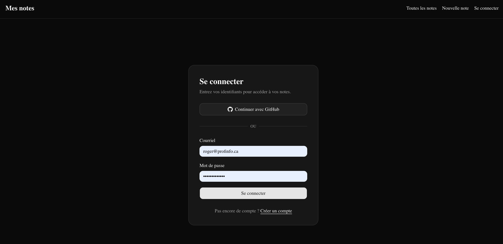

# Exercice - Better Auth — OAuth avec GitHub

Ajouter la connexion via GitHub à l'application de gestion de notes de l'exercice précédent :

- Créer une application OAuth sur GitHub :
    - Aller dans **GitHub → Settings → Developer settings → OAuth Apps → New OAuth App**
    - Remplir le formulaire avec `http://localhost:3000` comme URL et `http://localhost:3000/api/auth/callback/github` comme URL de rappel
    - Copier le **Client ID** et générer un **Client Secret**
- Configurer les variables d'environnement dans `.env` :
    - `GITHUB_CLIENT_ID` avec le Client ID GitHub
    - `GITHUB_CLIENT_SECRET` avec le Client Secret GitHub
- Modifier `lib/auth.ts` pour ajouter `github` dans `socialProviders`, aux côtés de `emailAndPassword`
- Ajouter un bouton « Se connecter avec GitHub » sur la page `/connexion` (composant client qui appelle `authClient.signIn.social({ provider: "github", callbackURL: "/notes" })`)
- Tester les deux méthodes de connexion (courriel + mot de passe et GitHub) et vérifier que les pages protégées restent accessibles dans les deux cas

<figure markdown>
  { width="600" }
  <figcaption>Aspect visuel de l'exercice de auth GitHub dans Next.js</figcaption>
</figure>
