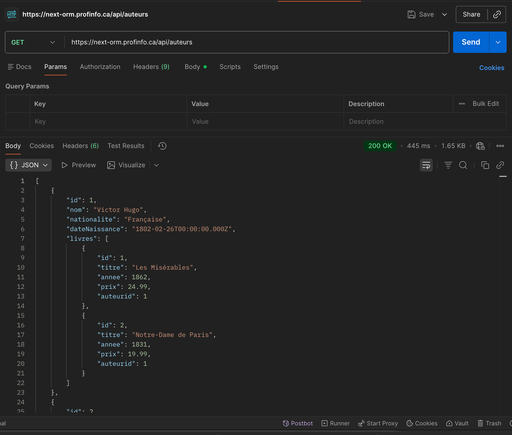

# Exercice - API Routes

Dans le projet créé pour [Prisma ORM](next_orm.md), ajoutez une API REST :  

- Créer `app/api/auteurs/route.ts` avec :
    - `GET` : retourner tous les auteurs
    - `POST` : ajouter un nouvel auteur
    - Valider que les données sont présentes, sinon retourner un `400`
- Créer `app/api/auteurs/[id]/route.ts` avec :
    - `GET` : retourner un auteur par son identifiant, `404` si introuvable
    - `PUT` : modifier un auteur existant
    - `DELETE` : supprimer un auteur et ses livres, `404` si introuvable

<figure markdown>
  { width="600" }
  <figcaption>Aspect visuel de l'exercice API dans Next.js</figcaption>
</figure>

[Version démo](https://next-orm.profinfo.ca/api/auteurs)  