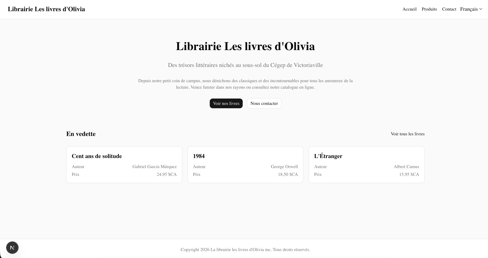
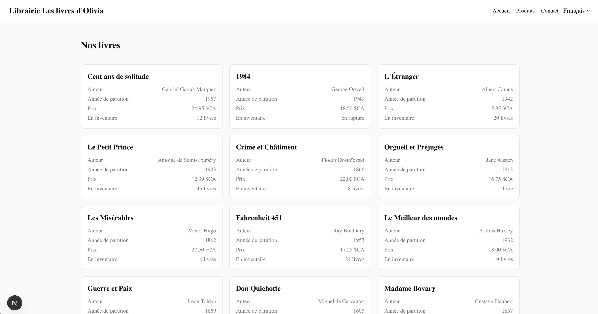

# Exercice - Internationalisation avec next-intl

Créer une application Next.js bilingue (français et anglais) de boutique en ligne :

- Configurer `next-intl` avec les langues `fr` et `en`, français par défaut
- Créer les fichiers de traductions `messages/fr.json` et `messages/en.json` avec :
    - Le titre de la boutique
    - Les libellés de navigation (Accueil, Produits, Contact)
    - Les libellés du catalogue (Nom, Prix, Quantite)
    - Un bas de page avec un copyright ayant une variable `{annee}`
    - Un message de quantité avec pluriel :  
        -  0 : aucun livre  
        -  1 : 1 livre  
        -  2+ : x livres  
- Créer les pages sous `app/[locale]/` :
    - `page.tsx` : page d'accueil avec message de bienvenue traduit
    - `produits/page.tsx` : liste de produits avec prix formatés en devise (CAD)
    - `contact/page.tsx` : formulaire de contact avec tous les libellés traduits
- Ajouter un sélecteur de langue dans le layout qui permet de basculer entre FR et EN en conservant la page courante

<figure markdown>
  { width="600" }
  <figcaption>Aspect visuel de l'exercice Intl dans Next.js</figcaption>
</figure>

<figure markdown>
  { width="600" }
  <figcaption>Aspect visuel de l'exercice Intl dans Next.js</figcaption>
</figure>

[Version démo](https://next-intl.profinfo.ca/fr)  