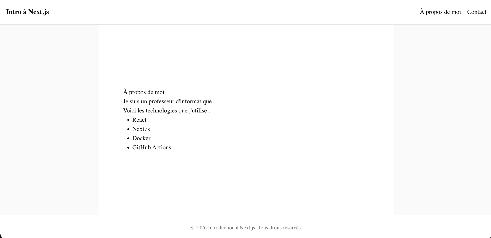

# Exercice - Introduction à Next.js

Créer une application Next.js de présentation personnelle :

- Créer un nouveau projet Next.js avec les options par défaut recommandées
- Modifier le fichier `app/page.tsx` pour afficher une page d'accueil avec :
    - Votre nom et une courte biographie
    - Une liste de vos technologies préférées
- Modifier les métadonnées (`metadata`) de la page d'accueil pour afficher un titre et une description personnalisés
- Créer deux composantes, `Entete` et `PiedDePage`  
- Modifier le `layout.tsx` pour ajouter un en-tête et un pied de page communs à toutes les pages
- Créer une deuxième page `app/contact/page.tsx` avec vos informations de contact et ses propres métadonnées
- Lancer le serveur de développement et vérifier le résultat dans le navigateur

<figure markdown>
  { width="600" }
  <figcaption>Aspect visuel de l'exercice d'introduction à Next.js</figcaption>
</figure>

[Version démo](https://next-intro.profinfo.ca)  

