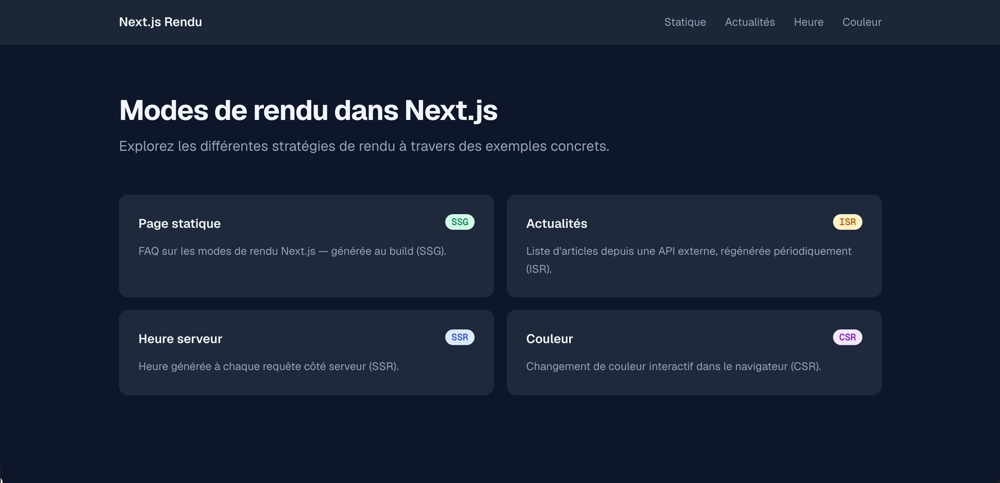

# Exercice - Modes de rendu Next.js

Créer une application qui démontre les différents modes de rendu :

- Créer une page `app/statique/page.tsx` en rendu statique (SSG) :
    - Affiche une page « FAQ » avec des questions/réponses codées en dur
    - Vérifier après `npm run build` que la route est marquée `○` (Static)
- Créer une page `app/actualites/page.tsx` en ISR :
    - Utiliser `export const revalidate = 30`
    - Récupérer des données depuis `https://jsonplaceholder.typicode.com/posts?_limit=5`
    - Afficher la liste des articles avec leur titre et contenu
    - Afficher la date et l'heure de génération de la page
- Créer une page `app/heure/page.tsx` en SSR :
    - Utiliser `export const dynamic = "force-dynamic"`
    - Afficher l'heure actuelle du serveur
    - Vérifier que l'heure se met à jour à chaque rafraîchissement
- Créer une page `app/couleur/page.tsx` en CSR :
    - Afficher un bouton qui change la couleur de fond de la page aléatoirement au clic
    - Utiliser `useState` et `"use client"`  
- Tester avec un `npm run build` et un `npm run start` 

Vous devriez avoir ceci comme résultat du `npm run build` :  

``` noderepl
next-rendu # npm run build

> next-rendu@0.1.0 build
> next build

▲ Next.js 16.2.9 (Turbopack)

  Creating an optimized production build ...
✓ Compiled successfully in 2.1s
✓ Finished TypeScript in 1454ms    
✓ Collecting page data using 7 workers in 411ms    
✓ Generating static pages using 7 workers (7/7) in 267ms
✓ Finalizing page optimization in 14ms    

Route (app)      Revalidate  Expire
┌ ○ /
├ ○ /_not-found
├ ○ /actualites         30s      1y
├ ○ /couleur
├ ƒ /heure
└ ○ /statique


○  (Static)   prerendered as static content
ƒ  (Dynamic)  server-rendered on demand
``` 


<figure markdown>
  { width="600" }
  <figcaption>Aspect visuel de l'exercice des modes de rendu dans Next.js</figcaption>
</figure>


[Version démo](https://next-rendu.profinfo.ca)  