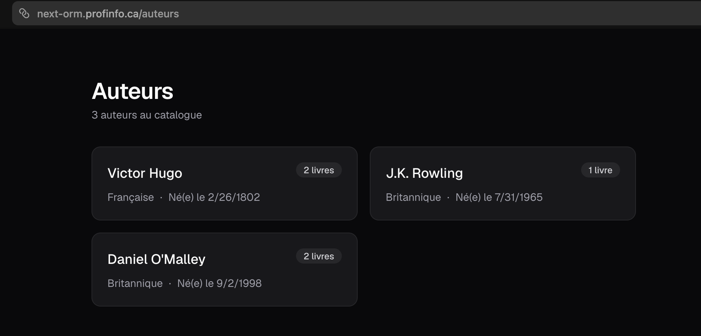
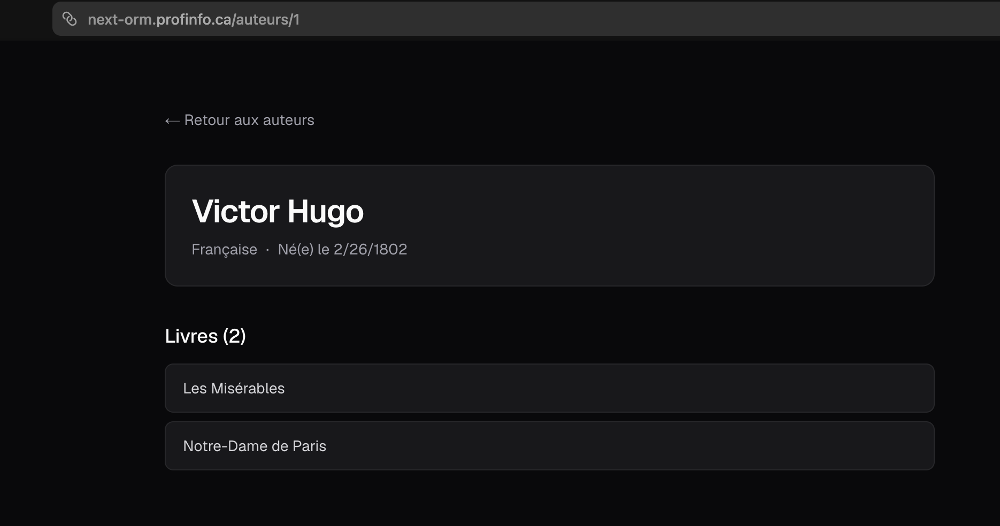

# Exercice - Prisma ORM

Créer une application de gestion d'une bibliothèque avec Prisma :

- Configurer Prisma avec une base de données MySQL :
    - Installer Prisma et configurer le fichier `.env`
    - Définir le schéma suivant dans `schema.prisma` :
        - Un modèle `Auteur` (id, nom, nationalite, dateNaissance optionnelle)
        - Un modèle `Livre` (id, titre, annee, prix, auteurId)
    - Exécuter la migration initiale
- Créer un fichier de seed `prisma/seed.ts` qui insère :
    - Au moins 3 auteurs
    - Au moins 5 livres répartis entre les auteurs
    - Exécutez le seed
- Utiliser Prisma Studio (`npx prisma studio`) pour vérifier les données insérées
- Créer les pages Next.js suivantes :
    - `app/auteurs/page.tsx` : liste de tous les auteurs avec le nombre de livres par auteur
    - `app/auteurs/[id]/page.tsx` : détail d'un auteur avec la liste de ses livres
    - `app/livres/page.tsx` : liste de tous les livres avec le nom de l'auteur 

<figure markdown>
  { width="600" }
  <figcaption>Aspect visuel de l'exercice ORM dans Next.js</figcaption>
</figure>

<figure markdown>
  { width="600" }
  <figcaption>Aspect visuel de l'exercice ORM dans Next.js</figcaption>
</figure>

[Version démo](https://next-orm.profinfo.ca)  