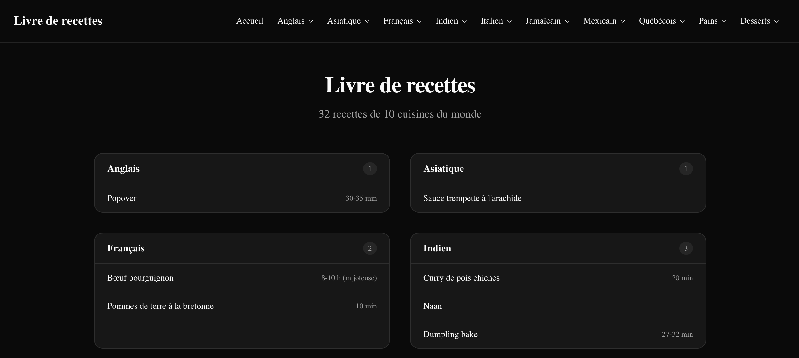

# Exercice - Routage Next.js

Créer un mini site de recettes de cuisine :

- Créer la structure de fichiers suivante :
    - `app/page.tsx` → page d'accueil avec liste des recettes (données statiques dans un tableau)
    - `app/recettes/page.tsx` → liste complète des recettes avec liens vers chaque recette
    - `app/recettes/[id]/page.tsx` → page de détail d'une recette selon son identifiant
    - `app/a-propos/page.tsx` → page À propos
- Ajouter un `layout.tsx` racine avec une barre de navigation contenant des liens `<Link>` vers toutes les sections
- Ajouter un fichier `loading.tsx` dans `app/recettes/` qui affiche un message de chargement
- Ajouter un fichier `error.tsx` dans `app/recettes/[id]/` qui affiche un message d'erreur si la recette n'existe pas
- La page de détail doit afficher un message « Recette introuvable » si l'`id` ne correspond à aucune recette du tableau

<figure markdown>
  { width="600" }
  <figcaption>Aspect visuel de l'exercice de routage dans Next.js</figcaption>
</figure>

[Version démo](https://next-routage.profinfo.ca)  