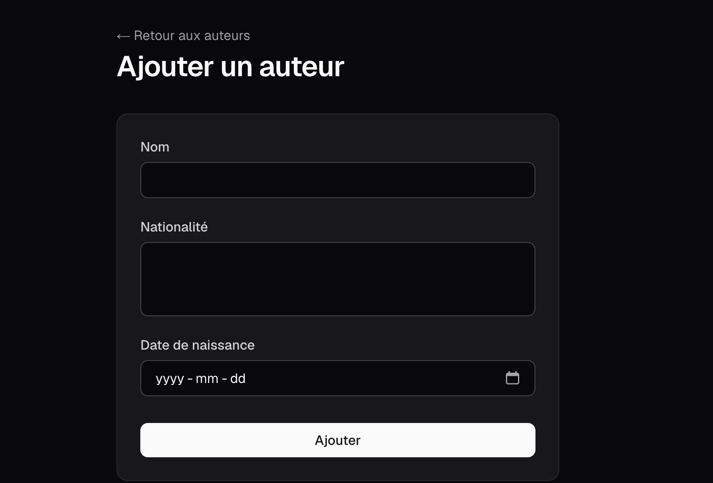

# Exercice - Server Actions et formulaires

Dans le projet créé pour [Prisma ORM](next_orm.md), utilisez les actions serveurs et formulaires :  

- Créer les actions serveur dans `app/actions/auteur.actions.ts` :
    - `creerAuteur` : valider et créer un auteur, revalider `/auteurs` et redirige sur `/auteurs`
    - `supprimerAuteur` : supprimer un auteur, revalider `/auteurs` et redirige sur `/auteurs`
    - `modifierAuteur` : mettre à jour un auteur, revalider `/auteurs` et redirige sur `/auteurs`
- Créer les pages suivantes :
    - `app/auteurs/nouveau/page.tsx` : formulaire de création avec action serveur dans l'attribut `action`
    - `app/auteurs/[id]/modifier/page.tsx` : formulaire de modification prérempli avec les données existantes
- Ajouter la validation côté serveur dans chaque action :
    - Le nom est obligatoire
    - La nationalité est obligatoire
    - La date de naissance est obligatoire
- Utiliser `useActionState` pour afficher les erreurs de validation dans le formulaire de création

<figure markdown>
  { width="600" }
  <figcaption>Aspect visuel de l'exercice Server Actions dans Next.js</figcaption>
</figure>

[Version démo](https://next-server-action.profinfo.ca)  