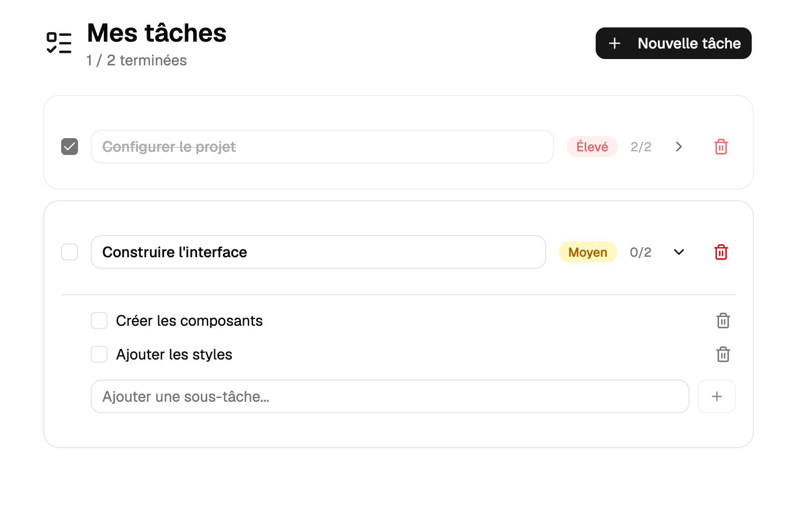

# Exercice - Immer

Refactoriser un gestionnaire de tâches qui utilise des `spread operators` verbeux pour adopter Immer, puis y ajouter de nouvelles fonctionnalités.

## Mise en contexte

Le code de départ ci-dessous contient un composant React qui gère des tâches avec des sous-tâches imbriquées via `useState`. Les fonctions de mise à jour utilisent des `spread operators` à répétition, ce qui les rend difficiles à lire et à maintenir.

## Étape 1 — Code de départ

Clonez le code de départ, une application complète que vous allez modifier :  

``` nodejsrepl title="console"  
git clone https://github.com/cegepvictoetienne/exercice-web3-immer.git   
``` 

## Étape 2 — Installer Immer

Installer Immer :

``` nodejsrepl title="console"
npm install immer
```
## Étape 3 — Refactoriser avec Immer

Réécrire chaque fonction de mise à jour en utilisant `produce` d'Immer avec `setTaches`. Chaque fonction doit devenir nettement plus lisible.

## Étape 4 — Ajouter une nouvelle fonctionnalité

Ajouter la fonction suivante **directement en version Immer** (sans passer par les spread operators) :

1. **`modifierTitre`** — Modifie le titre d'une tâche existante par son `id`

## Contraintes techniques

- Ne pas modifier les types définis dans `types.ts`
- L'état original ne doit jamais être muté directement — laisser Immer s'en charger
- Le comportement de l'application doit rester identique avant et après la refactorisation


<figure markdown>
  { width="600" }
  <figcaption>Aspect visuel de l'exercice d'immer avec React</figcaption>
</figure>


[Version démo](https://web3prof.fvfzs8f2k2.workers.dev/exercices-corriges/exercice-web3-immer/)  

