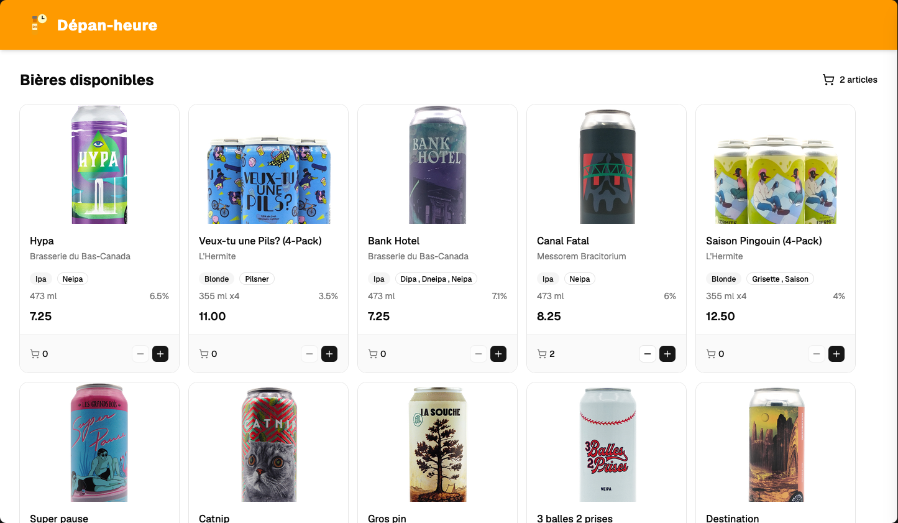

# Exercice - useContext et API  

Faire une boutique en ligne qui affiche une liste de bières et la gestion d’un panier (ajout et retrait de bières dans le panier)  

Au minimum, l'application doit avoir :   

- Un contexte    
- Un panier  
- Une grille avec des cartes représentant les bières (image, nom, prix, boutons + et - pour l'ajout et le retrait)   
- Les composants de shadcn   

L’API : [https://bieres.profinfo.ca/api/bieres](https://bieres.profinfo.ca/api/bieres)  

## Version démo  

<figure markdown>
  { width="600" }
  <figcaption>Aspect visuel de l'exercice de contexte dans React</figcaption>
</figure>

[Version démo](https://web3prof.fvfzs8f2k2.workers.dev/exercices-corriges/react_context/)  

