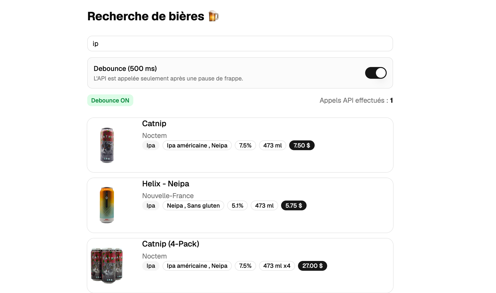

# Exercice - Anti-rebond et appels API

Construire un composant de recherche de bières qui utilise l'anti-rebond (debounce) pour limiter les appels à un API.

## Mise en contexte

L'application affiche un champ de texte. À chaque fois que l'utilisateur tape, on veut aller chercher les bières correspondantes via l'API `https://bieres.profinfo.ca/api/bieres/search?name=<terme>`. Sans anti-rebond, chaque frappe déclenche un appel — ce qui surcharge inutilement le serveur. L'objectif est de n'appeler l'API que lorsque l'utilisateur a arrêté de taper pendant 500ms.

Créer un outil de recherche avec un champ de recherche qui lance une requête quand l'utilisateur entre du texte, sans besoin de cliquer sur un bouton. 

## Cas limites à gérer

| Situation | Comportement attendu |
|-----------|---------------------|
| Champ vide | Vider la liste, ne pas appeler l'API |
| Aucun résultat | Afficher « Aucune bière trouvée » |
| Appel en cours | Afficher un indicateur de chargement |

## Contraintes techniques

- Ne pas appeler l'API si la recherche est vide ou ne contient que des espaces
- Le délai de debounce doit être de 500ms

## Pour vérifier que l'anti-rebond fonctionne

Ouvrir l'onglet **Réseau** des outils de développement du navigateur et taper rapidement plusieurs caractères. Vous devez voir un seul appel réseau se déclencher après votre dernière frappe, pas un appel par caractère.

<figure markdown>
  { width="600" }
  <figcaption>Aspect visuel de l'exercice anti-rebond avec React</figcaption>
</figure>

[Version démo](https://web3prof.fvfzs8f2k2.workers.dev/exercices-corriges/react-api/)  

