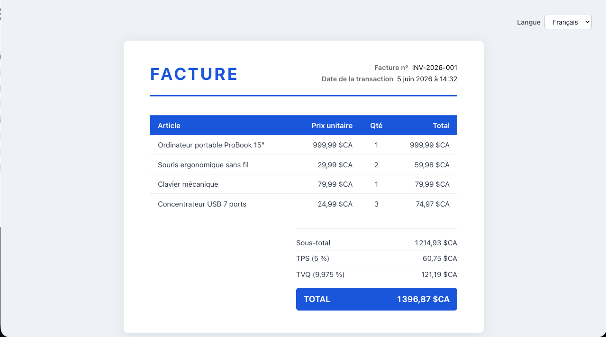

# Exercice - Internationalisation  

- Créer une application React
- Afficher une facture avec les éléments suivants :
    - Date et heure de la transaction
    - Au moins 3 items avec leurs prix unitaires, la quantité et le prix total
    - Un sous-total
    - Le calcul des taxes en indiquant entre parenthèses le pourcentage de la taxe
- Il doit y avoir un sélecteur de langue (Anglais et Français)
- Il doit y avoir un contexte de langue
- Tout doit être traduit et localisé - FR et EN.

## Version démo  

<figure markdown>
  { width="600" }
  <figcaption>Aspect visuel de l'exercice React-intl</figcaption>
</figure>

[Version démo](https://web3prof.fvfzs8f2k2.workers.dev/exercices-corriges/react_intl/)  

