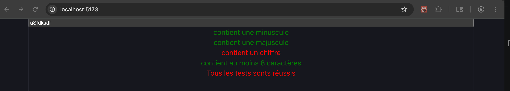

# Exercice - React  

- Faire un validateur de mot de passe :  
    - Avoir une composante et du css pour l’affichage de la validation et la gestion du rouge/vert.  
    - Utiliser useState pour gérer le mot de passe.  
    - Utiliser une interface pour les props de la composante.  
    - Utiliser les expression régulières pour tester le mot de passe.

<figure markdown>
  { width="600" }
  <figcaption>Aspect visuel de l'exercice d'introduction à React</figcaption>
</figure>

[Version démo](https://web3prof.fvfzs8f2k2.workers.dev/exercices-corriges/intro_react/)  

