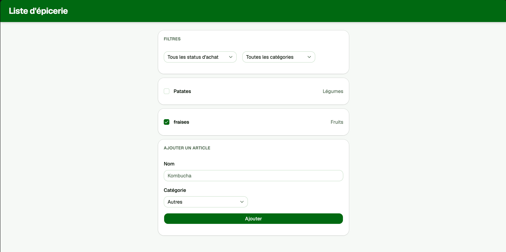

# Exercice - penser en react et mécanique de react

## Liste d'épicerie interactive

Construire une application de liste d'épicerie qui permet de gérer des articles par catégorie.

### Étape 1 — Penser en React

Avant de coder, décomposer l'interface en composants selon la méthodologie vue en classe :

1. Identifier les composants à partir d'une maquette froide de l'application
2. Organiser les composants en hiérarchie
3. Identifier les états minimaux nécessaires
4. Déterminer où chaque état doit vivre (principe de levée de l'état)


### Étape 2 — Construire la version statique

Commencer par construire une version statique avec des données en dur, sans état. Passer les données via `props` de haut en bas.

Chaque article a la structure suivante :

```ts
interface Article {
  id: number;
  nom: string;
  categorie: "fruits" | "légumes" | "produits laitiers" | "autres";
  achete: boolean;
}
```

### Étape 3 — Ajouter l'état et les interactions

Implémenter les fonctionnalités suivantes en respectant l'immuabilité de l'état :

- Ajouter un article via un formulaire (nom + catégorie)
- Supprimer un article de la liste
- Basculer l'état acheté/non-acheté d'un article (cocher/décocher)
- Filtrer la liste par catégorie (tous, fruits, légumes, etc.)

### Contraintes techniques

- Utiliser des identifiants uniques stables comme `key` pour chaque article (ne pas utiliser l'index du tableau)
- Mettre à jour l'état de façon immuable pour chaque opération :
    - Ajout : `[...articles, nouvelArticle]`
    - Suppression : `articles.filter(...)`
    - Modification : `articles.map(...)`
- Les articles cochés (achetés) doivent apparaître barrés visuellement
- Le compteur d'articles restants doit se mettre à jour automatiquement (valeur dérivée de l'état, non stockée)

### Version complétée  

[Version démo](https://web3prof.fvfzs8f2k2.workers.dev/exercices-corriges/liste_epicerie/)  


<figure markdown>
  { width="600" }
  <figcaption>Aspect visuel de l'exercice</figcaption>
</figure>
