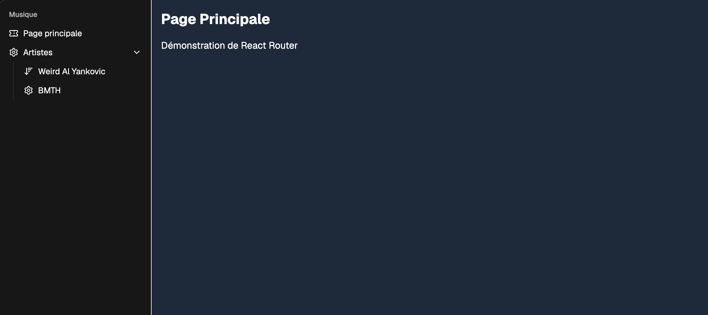

# Exercice - routes  

Faire un site avec les éléments suivants :  

- Une barre de latérale de menu, affichée sur chaque page  
- Au moins 3 options de menus   
- Au moins 1 page dynamique générée à partir des données d'un tableau  
- Au moins 2 liens vers la page dynamique  
- Utiliser shadcn et TailwindCSS  

### Version démo  

<figure markdown>
  { width="600" }
  <figcaption>Aspect visuel de l'exercice</figcaption>
</figure>

[Version démo](https://web3prof.fvfzs8f2k2.workers.dev/exercices-corriges/react_router/)  

