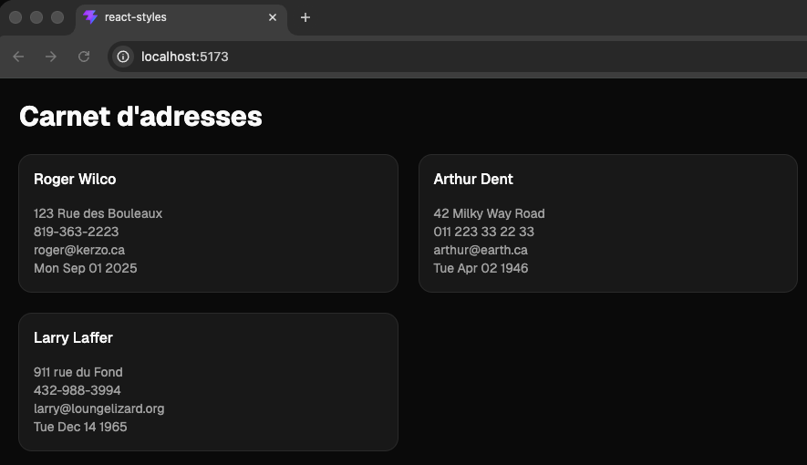

# Exercice - React et les styles  

- Faire un carnet d’adresses avec TailwindCSS et shadcn/ui  
- Afficher sous forme de carte les informations suivantes :  
    - Prénom  
    - Nom  
    - Adresse  
    - Numéro de téléphone  
    - Date de naissance  
    - Courriel  
- Utiliser le thème foncé ("dark")
 

<figure markdown>
  { width="600" }
  <figcaption>Aspect visuel de l'exercice de styles avec React</figcaption>
</figure>

[Version démo](https://web3prof.fvfzs8f2k2.workers.dev/exercices-corriges/react-styles/)  

