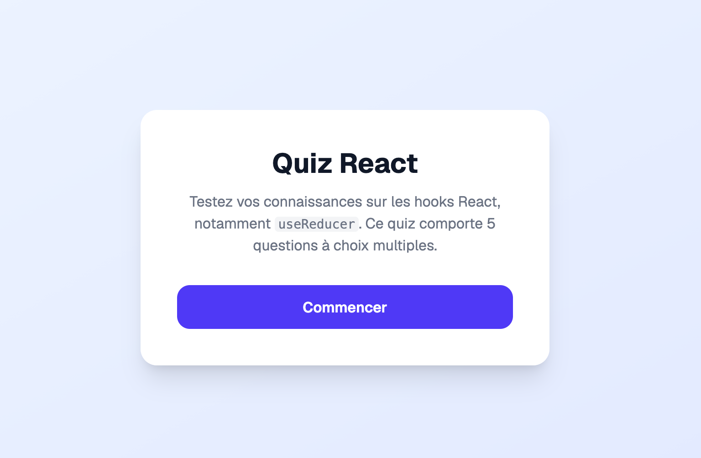
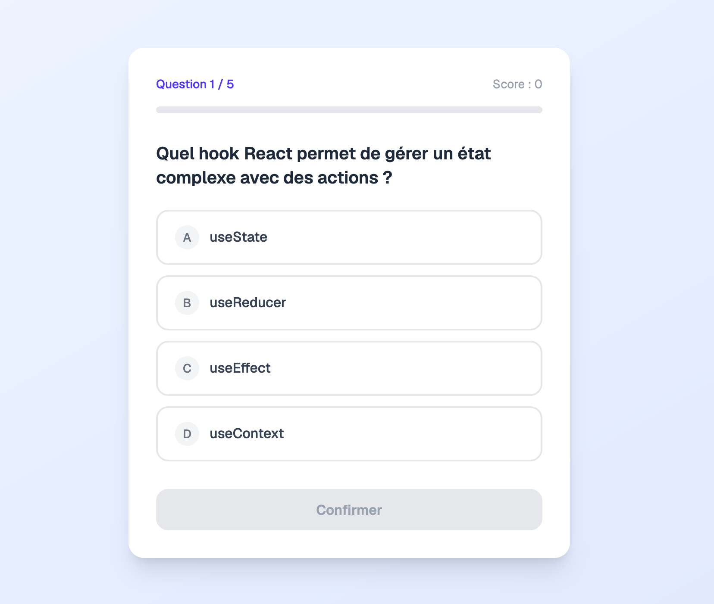

# Exercice - useReducer

Construire un quiz interactif dont l'état est entièrement géré par un `useReducer`.

## Mise en contexte

L'application affiche une série de questions à choix multiples. L'utilisateur sélectionne une réponse, confirme, puis passe à la question suivante. À la fin, un écran résumé affiche son score et lui permet de recommencer.

Ce scénario est un bon candidat pour `useReducer` : plusieurs actions distinctes modifient des parties différentes d'un même état, et certaines transitions dépendent de l'état courant (ex. : on ne peut pas passer à la question suivante sans avoir sélectionné une réponse).

## Étape 1 — Définir les types

Créer un fichier `types.ts` avec les types suivants :

``` ts title="types.ts"
export interface Question {
  enonce: string;
  choix: string[];
  bonneReponse: number; // index du bon choix dans le tableau
}

export type Phase = 'accueil' | 'en_cours' | 'termine';

export interface EtatQuiz {
  phase: Phase;
  questionCourante: number;
  score: number;
  reponseSelectionnee: number | null;
}
```

## Étape 2 — Préparer les données

Créer un fichier `questions.ts` avec au moins 5 questions :

``` ts title="questions.ts"
import { Question } from './types';

export const questions: Question[] = [
  {
    enonce: 'Quel hook React permet de gérer un état local simple ?',
    choix: ['useEffect', 'useState', 'useReducer', 'useRef'],
    bonneReponse: 1,
  },
  {
    enonce: "Quelle valeur retourne useState lors de son initialisation ?",
    choix: [
      "Un objet avec get et set",
      "Une valeur et une fonction de mise à jour",
      "Un tableau de toutes les valeurs",
      "Undefined jusqu'au premier rendu",
    ],
    bonneReponse: 1,
  },
  // Ajouter d'autres questions ici...
];
```

## Étape 3 — Définir les actions et écrire le reducer

Créer un fichier `reducer.ts`. Le reducer doit gérer ces quatre actions :

| Action | Effet |
|--------|-------|
| `DEMARRER` | Passe la phase à `'en_cours'` |
| `SELECTIONNER_REPONSE` | Enregistre la réponse choisie (payload : index de la réponse) |
| `QUESTION_SUIVANTE` | Si une réponse est sélectionnée : incrémente le score si bonne réponse, avance à la question suivante ou passe en phase `'termine'` |
| `RECOMMENCER` | Remet l'état initial |

``` ts title="reducer.ts"
import { EtatQuiz } from './types';
import { questions } from './questions';

export type Action =
  | { type: 'DEMARRER' }
  | { type: 'SELECTIONNER_REPONSE'; payload: number }
  | { type: 'QUESTION_SUIVANTE' }
  | { type: 'RECOMMENCER' };

export const etatInitial: EtatQuiz = {
  phase: 'accueil',
  indexQuestion: 0,
  score: 0,
  reponseSelectionnee: null,
};

export function reducer(etat: EtatQuiz, action: Action): EtatQuiz {
  // À compléter...
}
```

!!! warning
    Le reducer ne doit **jamais** modifier `etat` directement. Toujours retourner un nouvel objet.

## Étape 4 — Brancher le reducer dans le composant

Dans `Quiz.tsx`, utiliser `useReducer` avec le reducer et l'état initial définis à l'étape précédente :

``` ts title="Quiz.tsx"
import { useReducer } from 'react';
import { reducer, etatInitial } from './reducer';
import { questions } from './questions';

export function Quiz() {
  const [etat, dispatch] = useReducer(reducer, etatInitial);

  const questionCourante = questions[etat.indexQuestion];

  // À compléter : afficher le bon écran selon etat.phase
}
```

## Étape 5 — Construire l'interface

L'application doit afficher trois écrans différents selon `etat.phase` :

**Écran d'accueil** (`phase === 'accueil'`) :

- Un titre et une courte description
- Un bouton « Commencer » qui dispatche `DEMARRER`

**Écran de question** (`phase === 'en_cours'`) :

- L'énoncé de la question courante et son numéro (ex. : « Question 2 / 5 »)
- Les choix affichés comme boutons — le choix sélectionné doit être visuellement mis en évidence
- Un bouton « Confirmer » actif seulement si une réponse est sélectionnée, qui dispatche `QUESTION_SUIVANTE`

**Écran de résultat** (`phase === 'termine'`) :

- Le score final (ex. : « 3 / 5 »)
- Un message différent selon le score (ex. : excellent, bien, à améliorer)
- Un bouton « Recommencer » qui dispatche `RECOMMENCER`

## Contraintes techniques

- Tout l'état du quiz doit passer par `useReducer` — ne pas utiliser `useState` pour l'état du quiz
- Un `useState` séparé est autorisé uniquement pour les champs de saisie temporaires s'il y en a
- Le reducer doit être dans son propre fichier, séparé du composant
- Le tableau `questions` ne doit pas faire partie de l'état — c'est une donnée statique


 

<figure markdown>
  { width="600" }
  <figcaption>Aspect visuel de l'exercice useReducer React - Écran accueil</figcaption>
</figure>

<figure markdown>
  { width="600" }
  <figcaption>Aspect visuel de l'exercice useReducer React - Écran question</figcaption>
</figure>

<figure markdown>
  { width="600" }
  <figcaption>Aspect visuel de l'exercice useReducer React - Écran fin</figcaption>
</figure>

[Version démo](https://web3prof.fvfzs8f2k2.workers.dev/exercices-corriges/react-usereducer/)  

