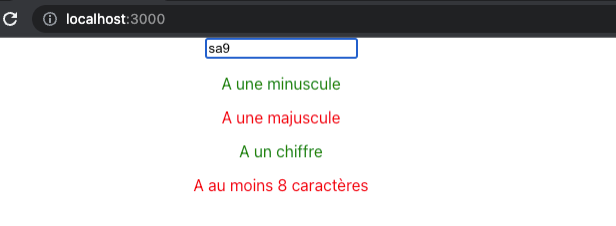

# Exercice - React  

- Faire un validateur de mot de passe :  
    - Avoir une composante pour l’affichage de la validation et la gestion du rouge/vert.  
    - Utiliser useState pour gérer les valeurs.  
    - Utiliser une interface pour les props de la composante.  

<figure markdown>
  { width="600" }
  <figcaption>Aspect visuel de l'exercice 9</figcaption>
</figure>

