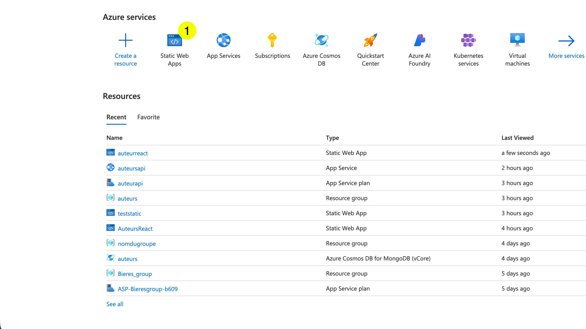
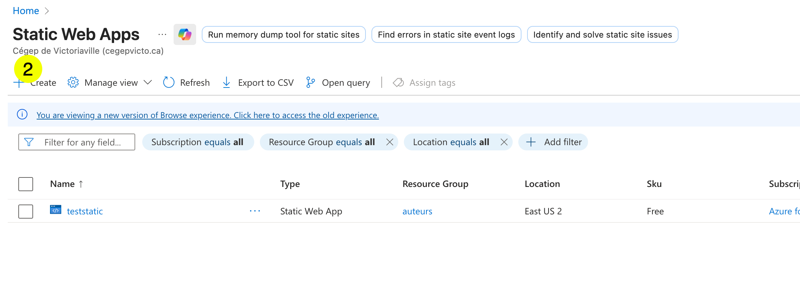
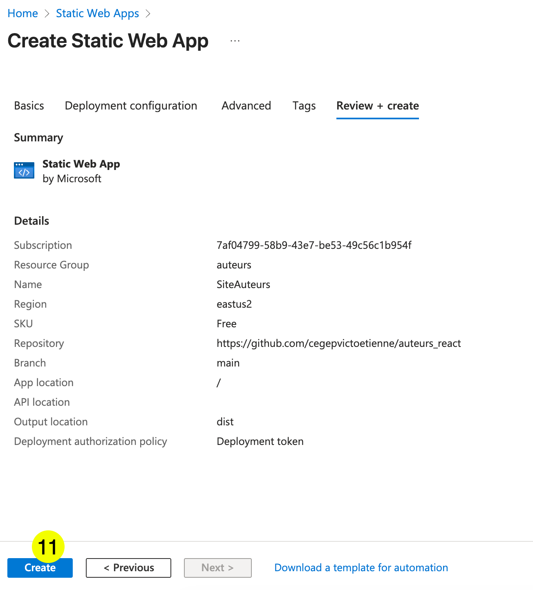
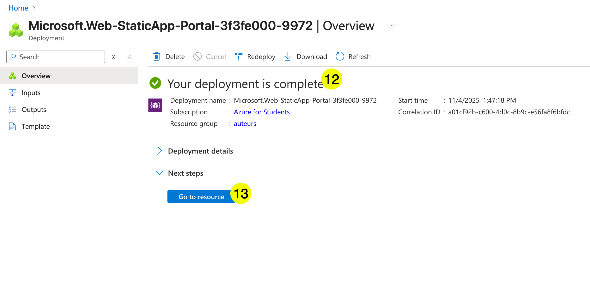
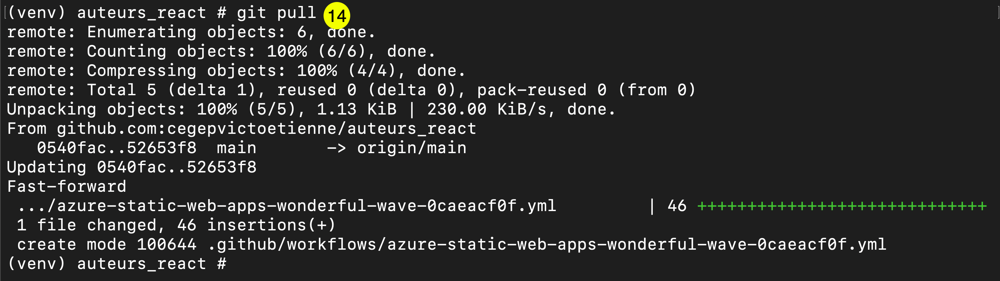
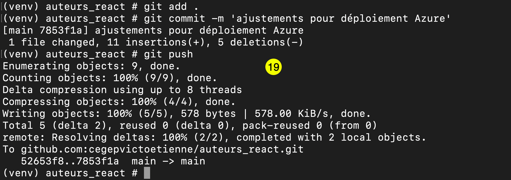
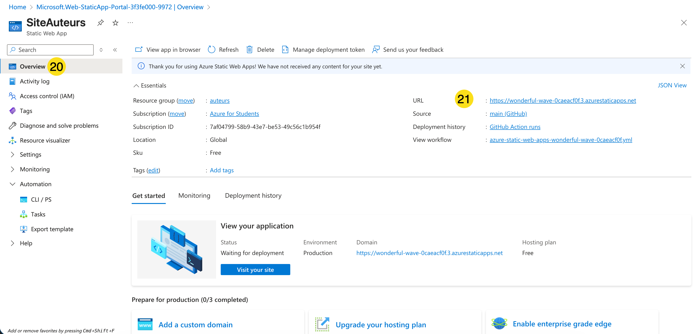
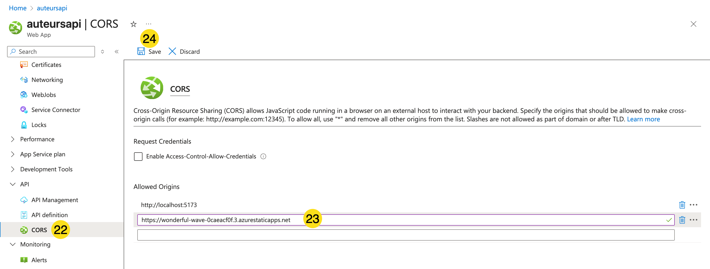

# Déploiement de Next.js dans Azure

# 1 - Créer un Azure Static Web App

   

1. Cliquer sur `Static Web App`

    

2. Cliquer sur `Create`

    

3. Choisir le groupe de ressource créé précédemment
4. Nommer votre site
5. Utiliser la version gratuite
6. Utiliser GitHub
7. Repérer votre dépôt de l'application Next.js
8. Choisir `Next.js` comme type de build
9. Laisser le champ de répertoire de sortie vide (Azure le détecte automatiquement)
10. Cliquer sur `Review + create`

    

11. Cliquer sur `Create`

    

12. Attendre que le statut indique que le déploiement est terminé.
13. Cliquer sur `Go to resource`

    

14. Azure a créé un fichier de flux de traitement. Le télécharger en faisant un `git pull`

    

15. Dans VSCode, vérifier le fichier de flux de travail généré dans `.github/workflows/`.  
    Azure configure automatiquement les étapes `npm install` et `npm run build` pour Next.js — aucune modification manuelle n'est requise.

# 2 - Variables d'environnement

Si votre application utilise une base de données (ex. : Prisma), vous devez configurer vos variables d'environnement dans Azure.

    

1. Dans votre ressource Static Web App, aller dans `Configuration`
2. Cliquer sur `Add`
3. Ajouter chaque variable (ex. : `DATABASE_URL`)
4. Cliquer sur `Save`

!!! warning
    Ne jamais pousser votre fichier `.env` sur GitHub. Toujours configurer vos secrets directement dans Azure.

# 3 - Pousser et obtenir l'URL

    

1. Pousser les modifications sur GitHub.

    

2. Aller à l'`Overview`
3. Copier l'URL de votre site.

# 4 - CORS (si applicable)

Si votre application Next.js appelle une API externe (non intégrée à Next.js), vous devez configurer le CORS.

    

1. Aller dans la ressource de votre API, dans la section CORS.
2. Ajouter votre URL.
3. Cliquer sur `Save`

!!! warning
    Ça peut prendre plusieurs minutes pour que les configurations CORS soient complétées.

!!! info
    Les routes API de Next.js (`app/api/...`) et les Server Actions sont automatiquement supportés par Azure Static Web Apps — aucune configuration supplémentaire n'est nécessaire.

Dernière étape : Tester votre site!
