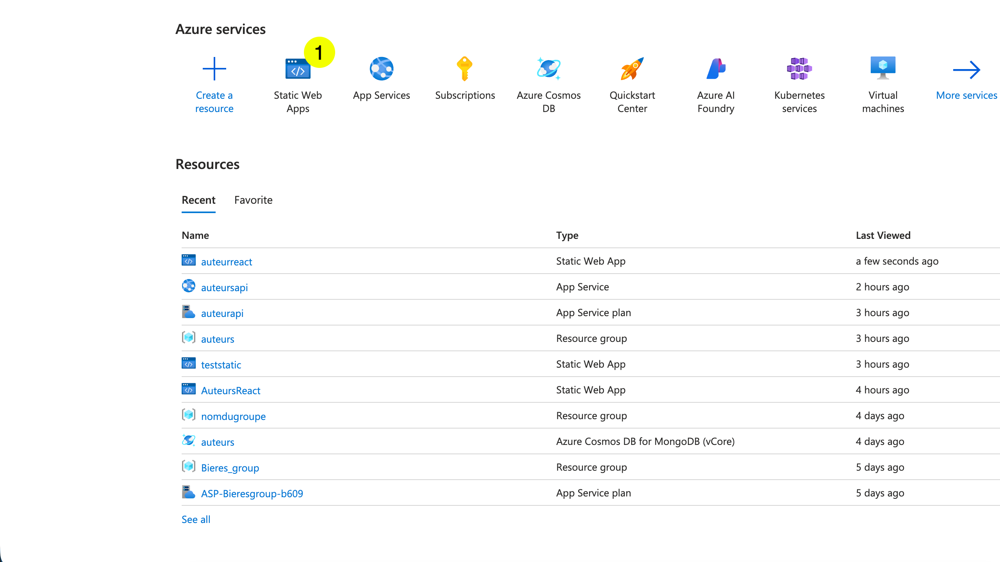
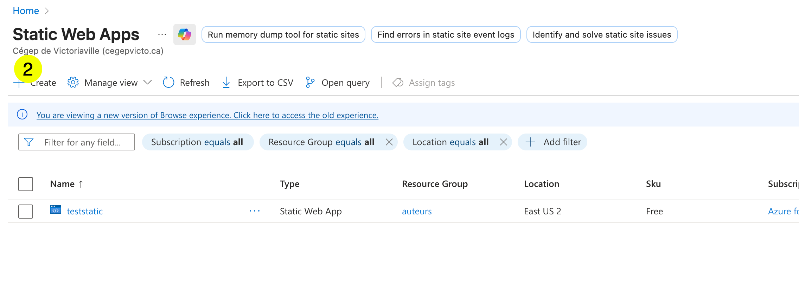
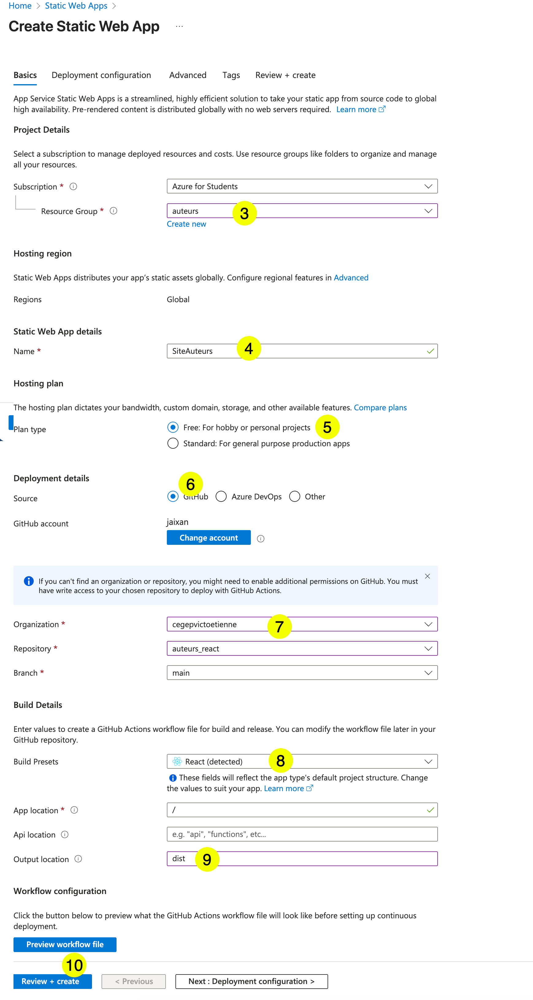
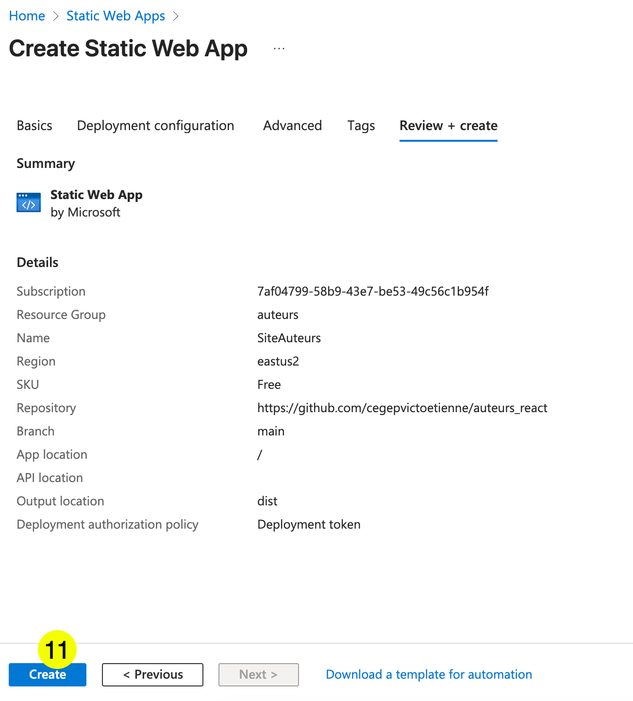
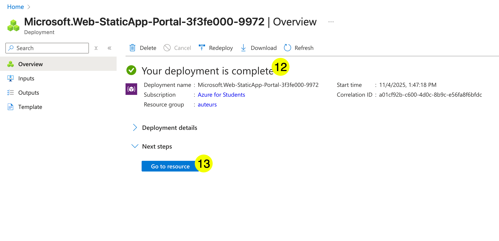
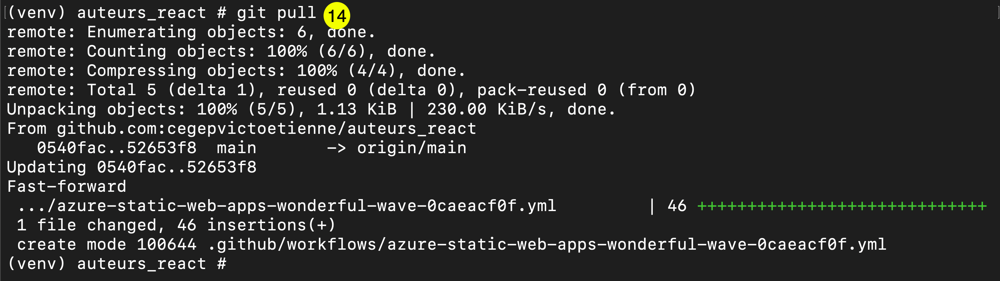
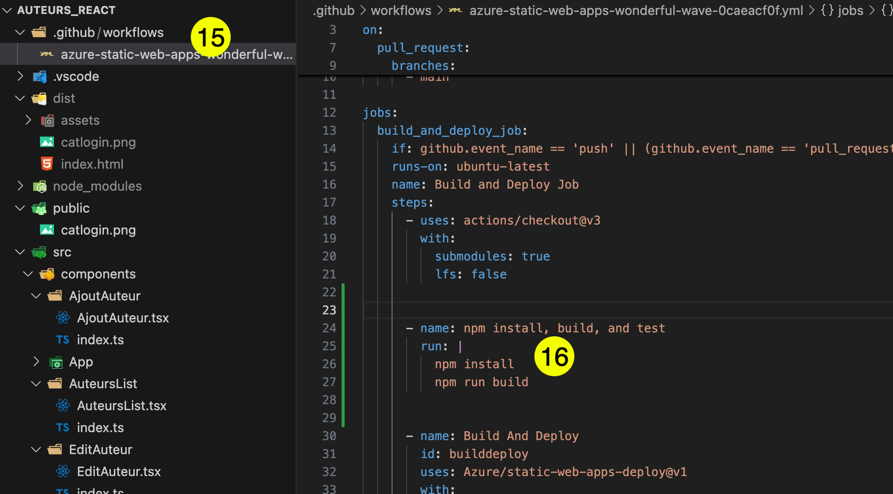
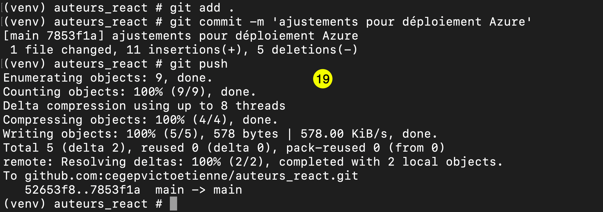
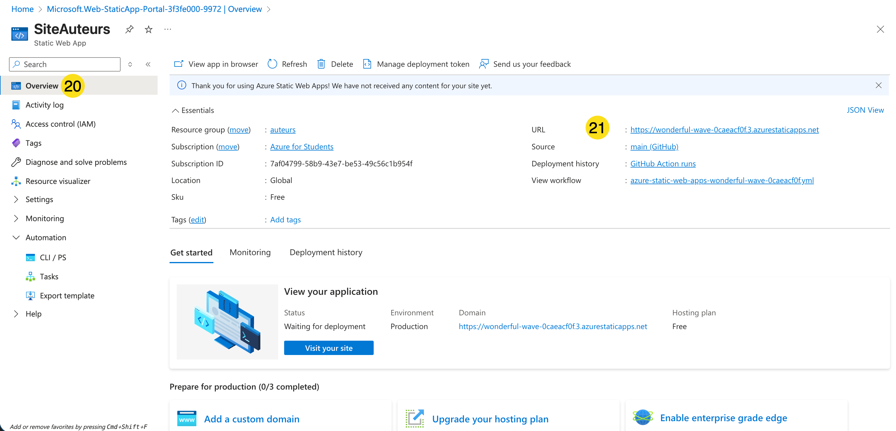
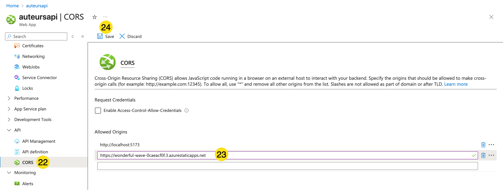

# Déploiement de React dans Azure

# 1 - Créer un Azure Static Web Site

     

1. Cliquer sur `Static Web App` 

      


2. Cliquer sur `Create`  


      

3. Choisir le groupe de ressource créé précédemment  
4. Nommer votre site  
5. Utiliser la version gratuite  
6. Utiliser GitHub  
7. Repérer votre dépot de l'application React  
8. Confirmer `React`  
9. Utiliser `dist` comme répertoire (celui créé par vite)  
10. Cliquer sur `Review + create`  


      

11. Cliquer sur `Create`  


      

12. Attendre que le status indique que le déploiement est terminé.  
13. Cliquer sur `Go to resource`  

      

14. Azure a créé un fichier de flux de traitement. Le télécharger en faisant un `git pull`  

      

15. Dans VSCode, modifier le flux de travail.  
16. Ajouter la section qui génère la version de production de votre site React : `npm install` et `npm run build`  

      

17. Pour le bon fonctionnement de react-router-dom, créer le fichier `staticwebapp.config.json`    
18. Copier le contenu suivant :  

   
    ``` json title="staticwebapp.config.json"  
    {
    "navigationFallback": {
        "rewrite": "/index.html",
        "exclude": ["/dist/*.{svg,png,jpg,gif}", "/dist/assets/*"]
    }
    }
    ``` 


      

19. Pousser les modifications sur github.  


      

20. Aller à l'`overview`  
21. Copier l'URL de votre site.  


      

22. Aller dans la ressource de votre API, dans la section CORS.  
23. Ajouter votre URL.  
24. Cliquer sur `Save`  

!!! warning  
    Ça peut prendre plusieurs minutes pour que les configurations CORS soient complétées.  


Dernière étape : Tester votre site!  


