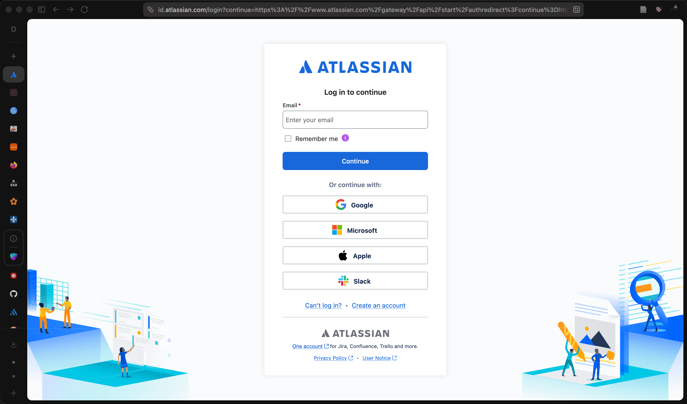
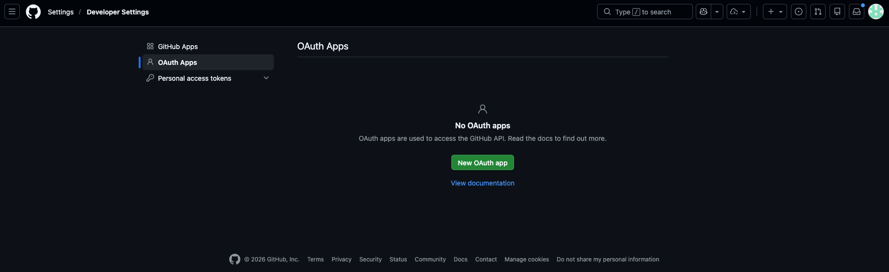
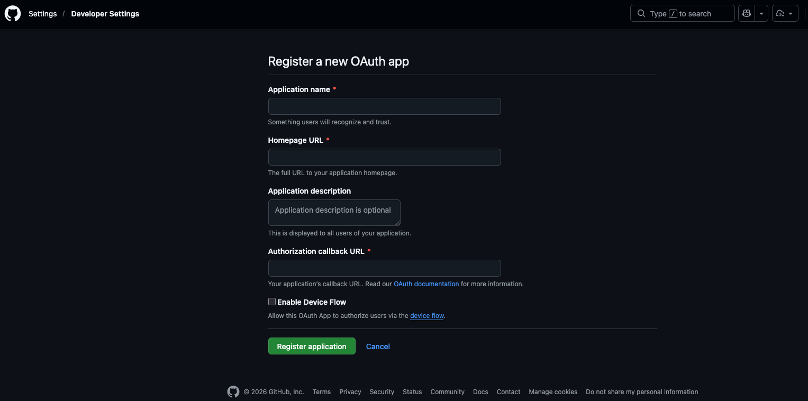

# Authentification OAuth avec GitHub

## Qu'est-ce que OAuth

Avez-vous déjà connecté à un site Web en utilisant votre compte Facebook/Google/Apple? Ce genre de connectivité se fait à travers un protocole standard, OAuth.  

Voici un exemple de page d'authentification (Jira)  :

  

L'idée est que le site Web fait confiance au fournisseur d'authenfication et ne reçoit que peu d'information. (Pas le mot de passe!).  


!!! manuel
    [Fournisseur GitHub - Auth.js](https://authjs.dev/getting-started/providers/github)  
    [OAuth Apps - GitHub Docs](https://docs.github.com/en/apps/oauth-apps/building-oauth-apps/creating-an-oauth-app)

## Créer une application OAuth sur GitHub

1. Allez dans **GitHub → Settings → Developer settings → OAuth Apps**
     
2. Cliquez sur **New OAuth App**
     
3. Remplissez le formulaire :

| Champ | Valeur en développement |
|---|---|
| Application name | Mon App Next.js |
| Homepage URL | `http://localhost:3000` |
| Authorization callback URL | `http://localhost:3000/api/auth/callback/github` |

4. Cliquez **Register application**
5. Notez le **Client ID** et générez un **Client Secret**

!!! warning "URL de rappel"
    L'URL de rappel doit correspondre exactement à ce qu'Auth.js attend : `/api/auth/callback/github`. En production, remplacez `localhost:3000` par votre domaine.

## Variables d'environnement

Ajoutez les identifiants GitHub dans votre fichier `.env` :

``` title=".env"
AUTH_SECRET="généré-par-npx-auth-secret"
AUTH_GITHUB_ID="votre-client-id-github"
AUTH_GITHUB_SECRET="votre-client-secret-github"
```

Auth.js reconnaît automatiquement les variables nommées `AUTH_<FOURNISSEUR>_ID` et `AUTH_<FOURNISSEUR>_SECRET`.

## Configuration du fournisseur GitHub

Ajoutez le fournisseur GitHub dans votre fichier `auth.ts` :

``` ts title="auth.ts"
import NextAuth from "next-auth"
import GitHub from "next-auth/providers/github"

export const { handlers, auth, signIn, signOut } = NextAuth({
  providers: [GitHub],
})
```

### Combiner GitHub et Credentials

Vous pouvez offrir plusieurs méthodes de connexion simultanément :

``` ts title="auth.ts"
import NextAuth from "next-auth"
import GitHub from "next-auth/providers/github"
import Credentials from "next-auth/providers/credentials"

export const { handlers, auth, signIn, signOut } = NextAuth({
  providers: [
    GitHub,
    Credentials({
      // configuration courriel + mot de passe...
    }),
  ],
})
```

## Bouton de connexion GitHub

``` tsx title="components/BoutonConnexionGitHub.tsx"
import { signIn } from "@/auth"

export function BoutonConnexionGitHub() {
  return (
    <form
      action={async () => {
        "use server"
        await signIn("github", { redirectTo: "/tableau-de-bord" })
      }}
    >
      <button type="submit">Se connecter avec GitHub</button>
    </form>
  )
}
```

``` tsx title="app/connexion/page.tsx"
import { BoutonConnexionGitHub } from "@/components/BoutonConnexionGitHub"

export default function PageConnexion() {
  return (
    <div>
      <h1>Connexion</h1>
      <BoutonConnexionGitHub />
    </div>
  )
}
```

## Données de session avec OAuth

Après la connexion via GitHub, Auth.js alimente automatiquement la session avec les informations du profil GitHub de l'utilisateur :

``` ts title="Contenu typique de session (OAuth GitHub)"
{
  user: {
    name: "Marie Tremblay",
    email: "marie@exemple.com",
    image: "https://avatars.githubusercontent.com/u/12345"
  },
  expires: "2025-07-30T..."
}
```

### Accéder à la session dans un composant serveur

``` tsx title="app/tableau-de-bord/page.tsx"
import { auth } from "@/auth"
import Image from "next/image"

export default async function TableauDeBord() {
  const session = await auth()

  return (
    <div>
      {session?.user?.image && (
        <Image
          src={session.user.image}
          alt="Avatar"
          width={64}
          height={64}
        />
      )}
      <p>Connecté en tant que {session?.user?.name}</p>
    </div>
  )
}
```

## Personnaliser les données de session

Si vous voulez l'ID de l'utilisateur dans l'objet de session, l'ajouter via les **callbacks** :

### 1. Déclarer les types étendus

``` ts title="types/next-auth.d.ts"
import { DefaultSession } from "next-auth"

declare module "next-auth" {
  interface Session {
    user: {
      id: string
    } & DefaultSession["user"]
  }
}
```

### 2. Configurer les callbacks dans auth.ts

``` ts title="auth.ts"
import NextAuth from "next-auth"
import GitHub from "next-auth/providers/github"

export const { handlers, auth, signIn, signOut } = NextAuth({
  providers: [GitHub],
  callbacks: {
    jwt({ token, user }) {
      if (user) {
        token.id = user.id
      }
      return token
    },
    session({ session, token }) {
      session.user.id = token.id as string
      return session
    },
  },
})
```
