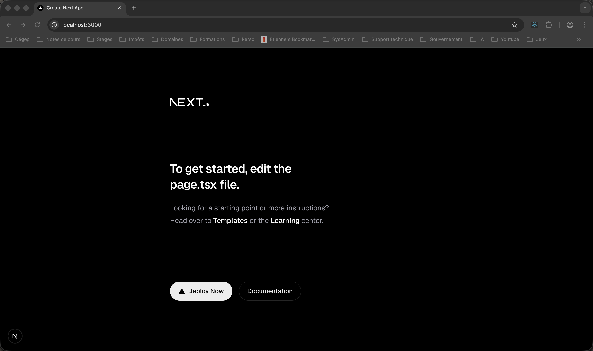

# Intro Next.js


# Qu'est-ce que Next.js   


# Création d'un projet  

``` noderepl
npx create-next-app@latest
``` 

``` noderepl  
? Would you like to use the recommended Next.js defaults? › - Use arrow-keys. Return to submit.
❯   Yes, use recommended defaults
    TypeScript, ESLint, Tailwind CSS, App Router
    No, reuse previous settings
    No, customize settings
``` 

Ça crée la page suivante :  

  

## TODO : Expliquer la différence de navigation entre React et Next.js  

## TODO : HTML de react (un seul div) VS HTML de next.js (tous le contenu)

## TODO : Expliquer les différents fichiers  

## TODO : Les métadonnées  

