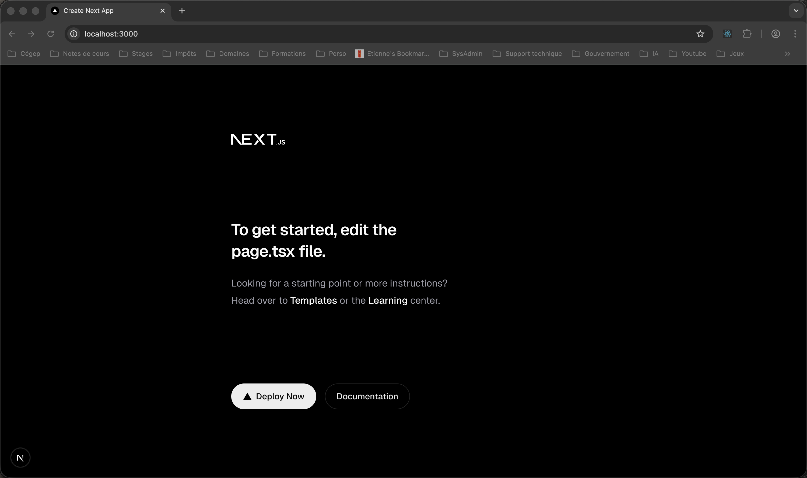

# Introduction à Next.js

## Qu'est-ce que Next.js

Depuis quelques années, les créateurs de React ont créé ce qui s'appelle des RSC (React Server Components). L'idée de ça est de générer le HTML du côté serveur. Next.js est une implémentation de RSC venant de la compagnie Vercel.


!!! manuel
    [Documentation Next.js](https://nextjs.org/docs)


### Différence dans le HTML généré

Avec React (Vite), le navigateur reçoit un HTML pratiquement vide. Tout le contenu est généré par JavaScript dans le navigateur :

``` html title="index.html"
<body>
  <div id="root"></div>
  <script type="module" src="/src/main.tsx"></script>
</body>
```

Avec Next.js, le serveur génère le HTML complet avant de l'envoyer au navigateur :

``` html title="HTML généré par Next.js"
<body>
  <main>
    <h1>Bienvenue sur mon application Next.js</h1>
    <p>Ceci est la page d'accueil.</p>
  </main>
  <script src="/_next/static/chunks/main.js"></script>
</body>
```


## Création d'un projet

Pour créer un nouveau projet Next.js, faire cette commande :

``` nodejsrepl title="console"
npx create-next-app@latest
```

Voici les options recommandées :

``` nodejsrepl title="console"
? Would you like to use the recommended Next.js defaults? › - Use arrow-keys. Return to submit.
❯   Yes, use recommended defaults
    TypeScript, ESLint, Tailwind CSS, App Router
    No, reuse previous settings
    No, customize settings
```

Cela crée la page suivante :

<figure markdown>
  { width="600" }
  <figcaption>Page par défaut d'une application Next.js</figcaption>
</figure>

## Structure du projet

Voici la structure d'un projet Next.js fraîchement créé :

```
mon-projet/
├── app/                  # Dossier principal de l'application
│   ├── layout.tsx        # Layout racine (gabarit principal)
│   ├── page.tsx          # Page d'accueil (route /)
│   ├── globals.css       # Styles CSS globaux
│   └── favicon.ico       # Icône du site
├── public/               # Fichiers statiques (images, etc.)
├── next.config.ts        # Configuration de Next.js
├── tsconfig.json         # Configuration TypeScript
├── package.json          # Dépendances et scripts
└── eslint.config.mjs     # Configuration ESLint
```

## Les fichiers importants

### layout.tsx - L'apparence globale de l'application Web  

Le fichier `layout.tsx` décrit l'apparence de l'application. Il contient la structure HTML de base pour toutes les pages (`<html>` et `<body>`).

``` ts title="app/layout.tsx"
--8<-- "next-intro/app/layout.tsx"
```

Points importants :

- `metadata` permet de définir le titre et la description de la page (balises `<title>` et `<meta>`).
- La propriété `children` représente le contenu de la page active.
- La disposition s'applique à **toutes les pages** de l'application.

### page.tsx - La page d'accueil

Le fichier `page.tsx` à la racine du dossier `app/` correspond à la route `/` (page d'accueil).

``` ts title="app/page.tsx"
--8<-- "next-intro/app/page.tsx"
```

### next.config.ts - La configuration

Le fichier `next.config.ts` permet de personnaliser le comportement de Next.js :

``` ts title="next.config.ts"
--8<-- "next-intro/next.config.ts"
```

## Les métadonnées

Next.js permet de définir les métadonnées de chaque page (titre, description, etc.) en exportant un objet `metadata` :

``` ts title="Exemple de métadonnées"
import type { Metadata } from "next";

export const metadata: Metadata = {
  title: "Mon application Next.js",
  description: "Ma première application Next.js",
};
```

Ces métadonnées sont automatiquement ajoutées à `<head>` du HTML. 

!!! manuel
    [Metadata - Documentation Next.js](https://nextjs.org/docs/app/building-your-application/optimizing/metadata)
