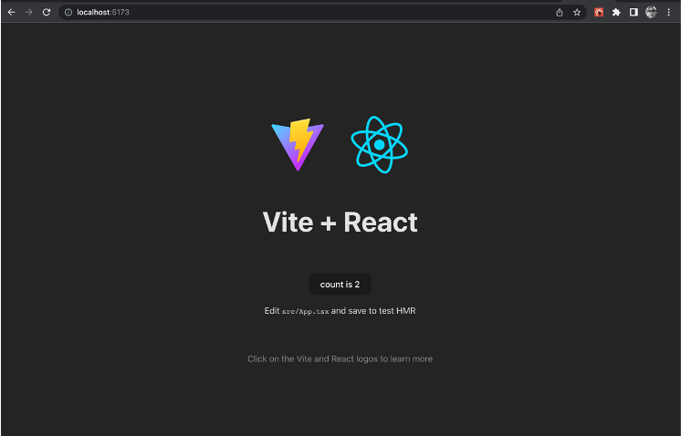
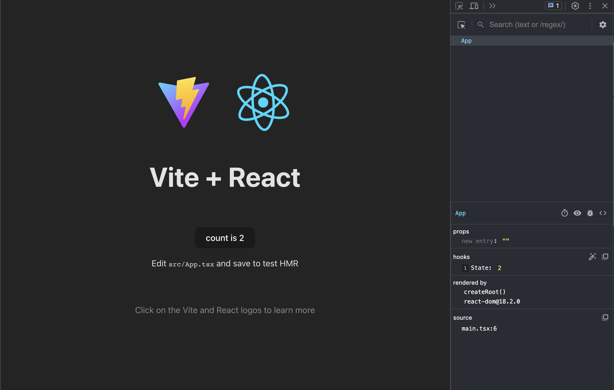
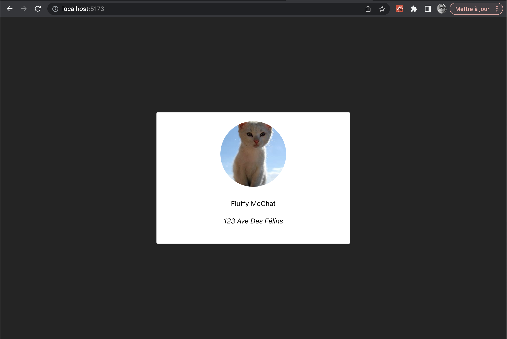
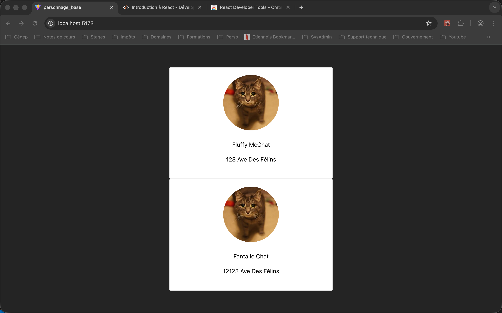
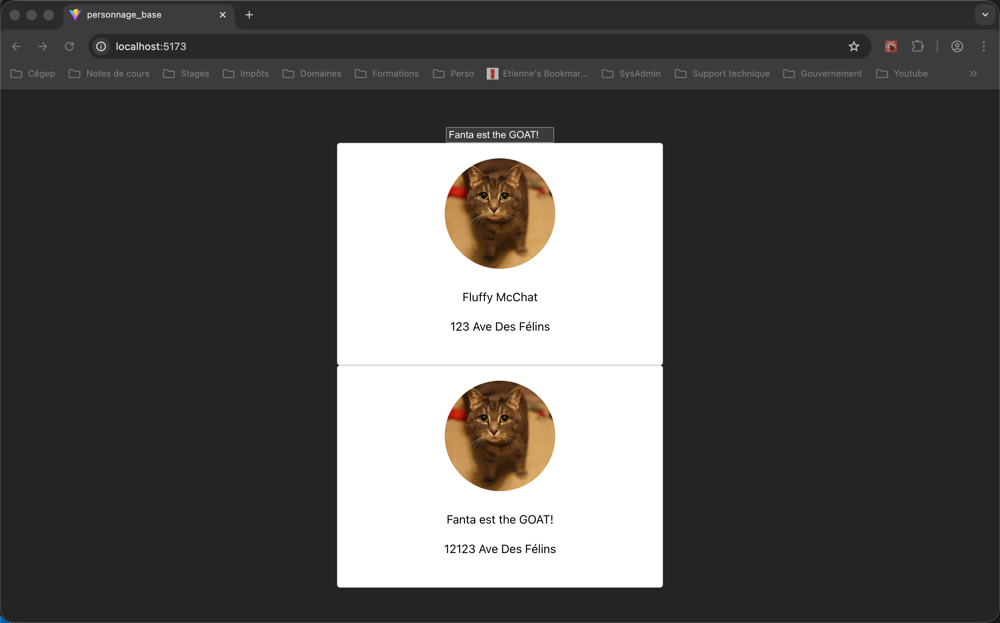
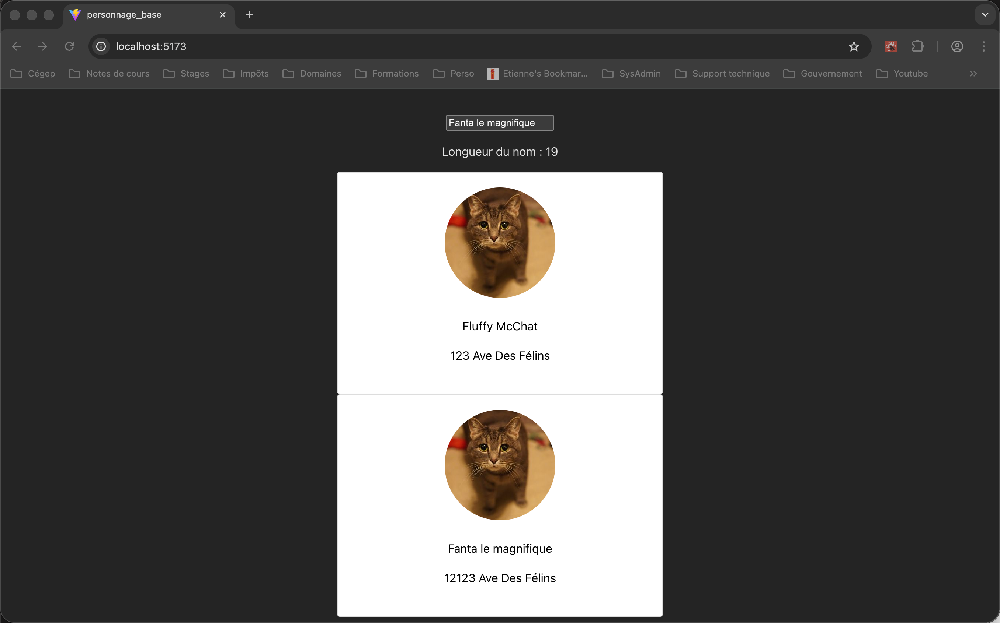

# React

## Générer un projet en React

Il y a plusieurs Générateur d’applications React qui permettent de générer la structure de base recommandée en JavaScript ou TypeScript.

Voici comment générer l’application :

1. Situez vous dans le dossier où vous désirez créer l’application (le dossier de l’application sera automatiquement créé à la prochaine étape)
1. Exécutez la commande de création d’application :
   ```nodejsrepl title="console"
   npm create vite@latest
   ```
1. Entrez le nom de votre projet :
   ```nodejsrepl title="console"
   > npx
   > "create-vite"
   │
   ◆  Project name:
   │  votre-nom-de-projet
   ```
1. Choisir **React** :
   ```nodejsrepl title="console"
   ◆  Select a framework:
   │  ○ Vanilla
   │  ○ Vue
   │  ● React
   │  ○ Preact
   │  ○ Lit
   │  ○ Svelte
   │  ○ Solid
   │  ○ Qwik
   │  ○ Angular
   │  ○ Marko
   │  ○ Others
   └
   ```
1. Choisir **Typescript** :
   ```nodejsrepl title="console"
   ◆  Select a variant:
   │  ● TypeScript
   │  ○ TypeScript + React Compiler
   │  ○ TypeScript + SWC
   │  ○ JavaScript
   │  ○ JavaScript + React Compiler
   │  ○ JavaScript + SWC
   │  ○ React Router v7 ↗
   │  ○ TanStack Router ↗
   │  ○ RedwoodSDK ↗
   │  ○ RSC ↗
   └
   ```
1. Choisir **No** :
   ```nodejsrepl title="console"
   ◆  Use rolldown-vite (Experimental)?:
   │  ○ Yes
   │  ● No
   └
   ```
1. Choisir **Yes** :
   ```nodejsrepl title="console"
   ◆  Install with npm and start now?
   │  ● Yes / ○ No
   └
   ```

<figure markdown>
  { width="600" }
  <figcaption>Page par défaut d'une application Vite en React</figcaption>
</figure>

!!! manuel
    [Documentation officielle Vite](https://vitejs.dev/guide/)

# React Developer Tools

React Developer Tools est un plugiciel dans Chrome pour aider au débogage de vos applications React.

Pour l'installer : [React Developer Tools pour Chrome](https://chrome.google.com/webstore/detail/react-developer-tools/fmkadmapgofadopljbjfkapdkoienihi)

<figure markdown>
  { width="600" }
  <figcaption>React Development Tools s'installe dans les outils de développement de Chrome</figcaption>
</figure>

# Programmer React avec des fonctions

Utiliser des fonctions au lieu des classes en React est la manière officielle de programmer dans cet environnement.

```ts title="Personnage.tsx"
{!personnage_base/src/components/Personnage/Personnage.tsx!}
```

```ts title="Personnage.css"
{!personnage_base/src/components/Personnage/Personnage.css!}
```

```ts title="app.tsx"
{!personnage_base/src/components/App/App.tsx!}
```

<figure markdown>
  { width="600" }
  <figcaption>Affichage du projet personnage - base</figcaption>
</figure>

!!! manuel
    [Learn React](https://react.dev/learn)

# Passage de paramètres avec les props

1. Définir la liste des paramètres dans une interface
2. L’ajouter comme props à la fonction de la composante
3. Utiliser les paramètres lors de l’instanciation de la composante

```ts title="Personnage.tsx"
{!personnage_base_props/src/components/Personnage/Personnage.tsx!}
```

```ts title="app.tsx"
{!personnage_base_props/src/components/App/App.tsx!}
```

<figure markdown>
  { width="600" }
  <figcaption>Affichage du projet personnage - base avec props</figcaption>
</figure>

!!! manuel
    [Props](https://react.dev/learn/passing-props-to-a-component)

# Les hooks - useState

- Conserve l’état d’une variable
- Réagit lorsque la valeur change

```ts title="App.tsx"
{!personnage_base_useState/src/components/App/App.tsx!}
```

<figure markdown>
  { width="600" }
  <figcaption>Affichage du projet personnage - base avec useState</figcaption>
</figure>

!!! manuel
    [useState](https://react.dev/reference/react/useState)

# Hooks : useEffect

Faire des traitements de données seulement lors d’événements précis, comme le premier render ou lors de changement d’une autre variable.

```ts title="app.tsx"
{!personnage_base_useEffect/src/components/App/App.tsx!}
```

<figure markdown>
  { width="600" }
  <figcaption>Affichage du projet personnage - base avec useEffect</figcaption>
</figure>

!!! manuel
    [useEffect](https://react.dev/reference/react/useEffect)
