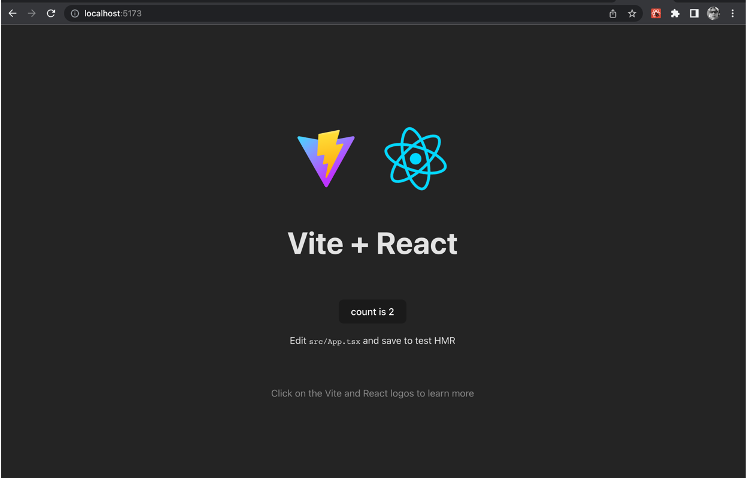
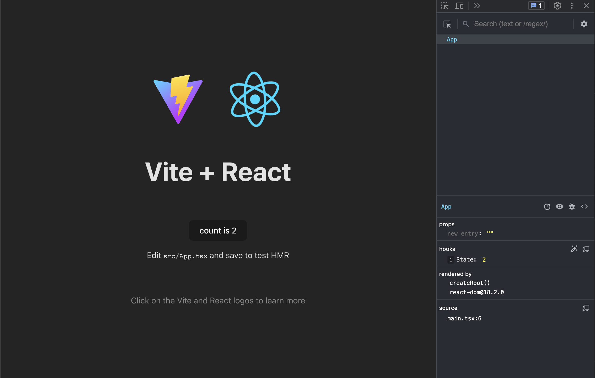
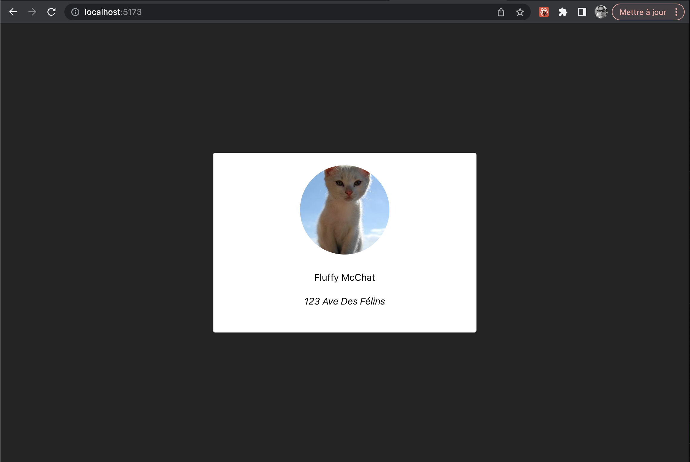
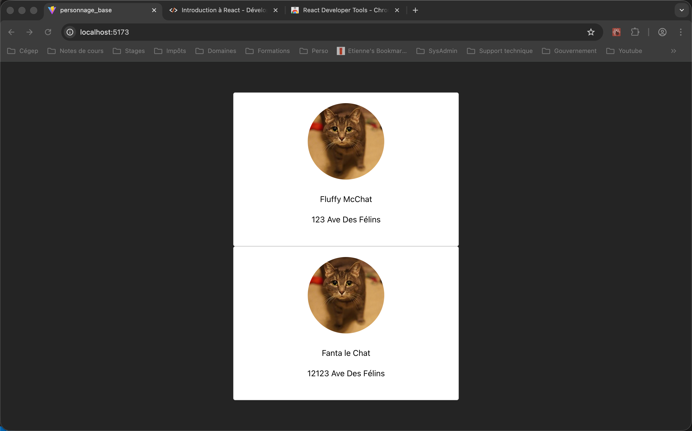

# React

## Générer un projet en React

Il y a plusieurs Générateur d’applications React qui permettent de générer la structure de base recommandée en JavaScript ou TypeScript.

Voici comment générer l’application :

1. Situez vous dans le dossier où vous désirez créer l’application (le dossier de l’application sera automatiquement créé à la prochaine étape)
1. Exécutez la commande de création d’application :
   ```nodejsrepl title="console"
   npm create vite@latest
   ```
1. Entrez le nom de votre projet :
   ```nodejsrepl title="console"
   > npx
   > "create-vite"
   │
   ◆  Project name:
   │  votre-nom-de-projet
   ```
1. Choisir **React** :
   ```nodejsrepl title="console"
   ◆  Select a framework:
   │  ○ Vanilla
   │  ○ Vue
   │  ● React
   │  ○ Preact
   │  ○ Lit
   │  ○ Svelte
   │  ○ Solid
   │  ○ Qwik
   │  ○ Angular
   │  ○ Marko
   │  ○ Others
   └
   ```
1. Choisir **Typescript** :
   ```nodejsrepl title="console"
   ◆  Select a variant:
   │  ● TypeScript
   │  ○ TypeScript + React Compiler
   │  ○ TypeScript + SWC
   │  ○ JavaScript
   │  ○ JavaScript + React Compiler
   │  ○ JavaScript + SWC
   │  ○ React Router v7 ↗
   │  ○ TanStack Router ↗
   │  ○ RedwoodSDK ↗
   │  ○ RSC ↗
   └
   ```
1. Choisir **No** :
   ```nodejsrepl title="console"
   ◆  Use rolldown-vite (Experimental)?:
   │  ○ Yes
   │  ● No
   └
   ```
1. Choisir **Yes** :
   ```nodejsrepl title="console"
   ◆  Install with npm and start now?
   │  ● Yes / ○ No
   └
   ```

<figure markdown>
  { width="600" }
  <figcaption>Page par défaut d'une application Vite en React</figcaption>
</figure>

!!! manuel
    [Documentation officielle Vite](https://vitejs.dev/guide/)

## React Developer Tools

React Developer Tools est un plugiciel dans Chrome pour aider au débogage de vos applications React.

Pour l'installer : [React Developer Tools pour Chrome](https://chrome.google.com/webstore/detail/react-developer-tools/fmkadmapgofadopljbjfkapdkoienihi)

<figure markdown>
  { width="600" }
  <figcaption>React Development Tools s'installe dans les outils de développement de Chrome</figcaption>
</figure>

## Le JSX

Le JSX (JavaScript XML) est une extension de syntaxe pour JavaScript qui permet d'écrire du code ressemblant à du HTML directement dans les fichiers TypeScript/JavaScript. React utilise le JSX pour décrire l'interface utilisateur.

```tsx title="Exemple.tsx"
function Exemple() {
  return (
    <div>
      <h1>Bonjour!</h1>
      <p>Ceci est du JSX.</p>
    </div>
  );
}
```

### Expressions JavaScript dans le JSX

Les accolades `{}` permettent d'insérer n'importe quelle expression JavaScript dans le JSX.

```tsx title="Exemple.tsx"
function Exemple() {
  const nom = "Alice";
  const age = 30;

  return (
    <div>
      <p>Nom : {nom}</p>
      <p>Âge : {age}</p>
      <p>Année de naissance : {2025 - age}</p>
    </div>
  );
}
```

### Différences entre JSX et HTML

Le JSX ressemble au HTML, mais il y a quelques différences importantes :

| HTML | JSX |
|------|-----|
| `class="..."` | `className="..."` |
| `for="..."` | `htmlFor="..."` |
| `<input>` | `<input />` (balise auto-fermante obligatoire) |
| Attributs en kebab-case | Attributs en camelCase |

```tsx title="Exemple.tsx"
function Exemple() {
  return (
    <div className="conteneur">
      <label htmlFor="prenom">Prénom :</label>
      <input id="prenom" type="text" />
    </div>
  );
}
```

### Un seul élément racine

Une composante React doit retourner un seul élément racine. Si vous avez besoin de regrouper plusieurs éléments sans ajouter un nœud HTML supplémentaire, utilisez un **Fragment** (`<>`).

```tsx title="Exemple.tsx"
function Exemple() {
  return (
    <>
      <h1>Titre</h1>
      <p>Paragraphe</p>
    </>
  );
}
```

!!! manuel
    [JSX - Documentation officielle React](https://react.dev/learn/writing-markup-with-jsx)

## Le rendu conditionnel

Le rendu conditionnel permet d'afficher ou de masquer des éléments selon une condition, comme un `if` en JavaScript.

### Avec un `if`

La manière la plus simple est d'utiliser un `if` classique pour retourner du JSX différent selon la condition.

```tsx title="Exemple.tsx"
function Message({ estConnecte }: { estConnecte: boolean }) {
  if (estConnecte) {
    return <p>Bienvenue, vous êtes connecté!</p>;
  }
  return <p>Veuillez vous connecter.</p>;
}
```

### Avec l'opérateur ternaire

L'opérateur ternaire `? :` permet d'écrire la condition directement dans le JSX.

```tsx title="Exemple.tsx"
function Message({ estConnecte }: { estConnecte: boolean }) {
  return (
    <p>
      {estConnecte ? "Bienvenue, vous êtes connecté!" : "Veuillez vous connecter."}
    </p>
  );
}
```

### Avec l'opérateur `&&`

L'opérateur `&&` est utile pour afficher un élément uniquement si la condition est vraie, sans avoir de cas alternatif.

```tsx title="Exemple.tsx"
function Notification({ nombreMessages }: { nombreMessages: number }) {
  return (
    <div>
      <h1>Boîte de réception</h1>
      {nombreMessages > 0 && (
        <p>Vous avez {nombreMessages} nouveau(x) message(s).</p>
      )}
    </div>
  );
}
```

!!! warning "Attention"
    Évitez d'utiliser `&&` avec un nombre comme condition. Si `nombreMessages` vaut `0`, React affichera le chiffre `0` au lieu de ne rien afficher. Préférez une comparaison explicite comme `nombreMessages > 0`.

!!! manuel
    [Rendu conditionnel - Documentation officielle React](https://react.dev/learn/conditional-rendering)

## Le rendu de listes

Pour afficher une liste d'éléments, on utilise la méthode `.map()` de JavaScript pour transformer un tableau de données en tableau d'éléments JSX.

```tsx title="Exemple.tsx"
function ListeFruits() {
  const fruits = ["Pomme", "Banane", "Orange"];

  return (
    <ul>
      {fruits.map((fruit) => (
        <li>{fruit}</li>
      ))}
    </ul>
  );
}
```

### La prop `key`

Chaque élément d'une liste doit avoir une prop `key` unique. Elle permet à React d'identifier les éléments et d'optimiser les mises à jour de l'interface.

```tsx title="Exemple.tsx"
interface Produit {
  id: number;
  nom: string;
  prix: number;
}

function ListeProduits({ produits }: { produits: Produit[] }) {
  return (
    <ul>
      {produits.map((produit) => (
        <li key={produit.id}>
          {produit.nom} — {produit.prix} $
        </li>
      ))}
    </ul>
  );
}
```

!!! warning "Attention"
    N'utilisez pas l'index du tableau comme `key` si la liste peut être réordonnée ou filtrée. Préférez un identifiant unique provenant des données (ex. : `id`).

### Filtrer une liste

On peut combiner `.filter()` et `.map()` pour n'afficher que les éléments qui correspondent à une condition.

```tsx title="Exemple.tsx"
function ListeProduitsEnSolde({ produits }: { produits: Produit[] }) {
  return (
    <ul>
      {produits
        .filter((produit) => produit.prix < 10)
        .map((produit) => (
          <li key={produit.id}>
            {produit.nom} — {produit.prix} $
          </li>
        ))}
    </ul>
  );
}
```

!!! manuel
    [Rendu de listes - Documentation officielle React](https://react.dev/learn/rendering-lists)

## Programmer React avec des fonctions

Utiliser des fonctions au lieu des classes en React est la manière officielle de programmer dans cet environnement.

```ts title="Personnage.tsx"
--8<-- "personnage_base/src/components/Personnage/Personnage.tsx"
```

```ts title="Personnage.css"
--8<-- "personnage_base/src/components/Personnage/Personnage.css"
```

```ts title="app.tsx"
--8<-- "personnage_base/src/components/App/App.tsx"
```

<figure markdown>
  { width="600" }
  <figcaption>Affichage du projet personnage - base</figcaption>
</figure>

!!! manuel
    [Learn React](https://react.dev/learn)

## Passage de paramètres avec les props

1. Définir la liste des paramètres dans une interface
2. L’ajouter comme props à la fonction de la composante
3. Utiliser les paramètres lors de l’instanciation de la composante

```ts title="Personnage.tsx"
--8<-- "personnage_base_props/src/components/Personnage/Personnage.tsx"
```

```ts title="app.tsx"
--8<-- "personnage_base_props/src/components/App/App.tsx"
```

<figure markdown>
  { width="600" }
  <figcaption>Affichage du projet personnage - base avec props</figcaption>
</figure>

!!! manuel
    [Props](https://react.dev/learn/passing-props-to-a-component)

