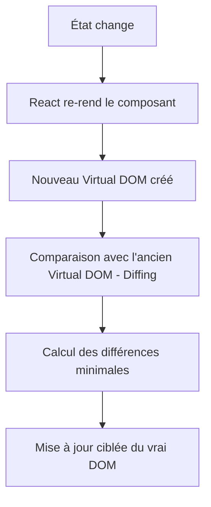
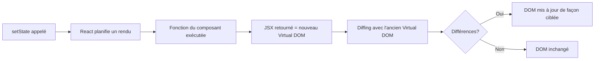

# Mécanique de React

## Le Virtual DOM

React n'interagit pas directement avec le DOM du navigateur à chaque changement. Il maintient plutôt une représentation légère en mémoire appelée le **Virtual DOM**.

### Comment ça fonctionne



1. Lorsqu'un état change, React crée un nouveau Virtual DOM (une copie de l'arbre JSX en mémoire)
2. React compare ce nouveau Virtual DOM avec le précédent — c'est l'étape de **diffing**
3. Seules les différences réelles sont appliquées au vrai DOM du navigateur — c'est la **réconciliation**

!!! info "Pourquoi le Virtual DOM?"
    Manipuler le vrai DOM est coûteux en performance. Le Virtual DOM permet à React de regrouper les changements et de n'effectuer que les mises à jour strictement nécessaires.

!!! manuel
    [Comprendre la réconciliation](https://react.dev/learn/preserving-and-resetting-state)

---

## Le cycle de rendu

Un composant React se **rend** (render) lorsque :

- Il est affiché pour la première fois (montage)
- Son état (`useState`) change
- Ses `props` changent
- Son composant parent se re-rend

### Animation interactive — le cycle complet

<iframe src="./cycle_rendu_react.html" style="width:100%;height:800px;border:none;border-radius:12px;"></iframe>

### Les 4 phases du rendu

| Phase | Description |
|-------|-------------|
| **Déclenchement** | Un état ou des props changent, React planifie un rendu |
| **Render & Virtual DOM** | React appelle la fonction du composant, produit un nouveau Virtual DOM en mémoire |
| **Diffing** | React compare l'ancien et le nouveau Virtual DOM pour identifier les différences minimales |
| **Commit** | React applique uniquement les différences au vrai DOM, puis exécute les `useEffect` |

!!! warning "Le rendu n'est pas la mise à jour du DOM"
    « Rendre » un composant signifie que React appelle votre fonction. Cela ne veut pas dire que le DOM est forcément modifié — si le résultat JSX est identique, React ne touche pas au DOM.

### Exemple : visualiser les rendus

```tsx title="Compteur.tsx"
import { useState } from "react";

function Compteur() {
  const [compte, setCompte] = useState(0);

  console.log("Rendu du composant"); // S'affiche à chaque rendu

  return (
    <div>
      <p>Compte : {compte}</p>
      <button onClick={() => setCompte(compte + 1)}>+1</button>
    </div>
  );
}
```

!!! tip "React Developer Tools"
    Activez l'option **Highlight updates when components render** dans React Developer Tools pour visualiser visuellement quels composants se re-rendent.

---

## Les états immuables

En React, l'état doit être traité comme **immuable** : on ne modifie jamais directement la valeur d'un état, on le **remplace**.

### Pourquoi l'immuabilité?

React détecte les changements d'état par **comparaison de référence** (`===`). Si vous mutez un objet en place, React ne voit aucun changement et ne re-rend pas le composant.

```tsx title="Mauvaise pratique - mutation directe"
const [joueur, setJoueur] = useState({ nom: "Alice", score: 0 });

// MAUVAIS : React ne détecte pas le changement
joueur.score = 10;
setJoueur(joueur); // Même référence → pas de re-rendu
```

```tsx title="Bonne pratique - remplacement par une copie"
const [joueur, setJoueur] = useState({ nom: "Alice", score: 0 });

// BON : Nouvelle référence → re-rendu déclenché
setJoueur({ ...joueur, score: 10 });
```

### Tableaux immuables

Les tableaux dans un état doivent aussi être remplacés, jamais mutés :

```tsx title="Gestion immuable des tableaux"
const [items, setItems] = useState(["pomme", "banane"]);

// MAUVAIS : push mute le tableau existant
items.push("cerise");
setItems(items);

// BON : Spread pour créer un nouveau tableau
setItems([...items, "cerise"]);

// BON : filter retourne un nouveau tableau
setItems(items.filter(item => item !== "banane"));

// BON : map retourne un nouveau tableau
setItems(items.map(item => item === "pomme" ? "POMME" : item));
```

!!! note "Opérations sûres vs dangereuses"
    | Opération | Sûre | Dangereuse |
    |-----------|------|------------|
    | Ajouter | `[...arr, nouvelElement]` | `push()` |
    | Supprimer | `filter()` | `splice()` |
    | Modifier | `map()` | Assignation directe |
    | Trier | `[...arr].sort()` | `sort()` directement |

!!! manuel
    [Mettre à jour les objets dans le state](https://react.dev/learn/updating-objects-in-state)

    [Mettre à jour les tableaux dans le state](https://react.dev/learn/updating-arrays-in-state)

---

## Les instantanés d'état (snapshots)

Chaque rendu d'un composant capture un **instantané** des valeurs d'état au moment du rendu. Les gestionnaires d'événements utilisent toujours les valeurs de cet instantané, même si l'état change plus tard.

```tsx title="Comportement des instantanés"
const [compte, setCompte] = useState(0);

function incrementerTroisFois() {
  // compte vaut 0 au moment de cet appel
  setCompte(compte + 1); // planifie : 0 + 1 = 1
  setCompte(compte + 1); // planifie : 0 + 1 = 1 (même instantané!)
  setCompte(compte + 1); // planifie : 0 + 1 = 1 (même instantané!)
  // Résultat : compte passe à 1, pas à 3!
}
```

Pour accumuler plusieurs mises à jour dans le même rendu, utilisez la **forme fonctionnelle** :

```tsx title="Mise à jour fonctionnelle"
function incrementerTroisFois() {
  // La fonction reçoit la valeur la plus récente en attente
  setCompte(c => c + 1); // 0 → 1
  setCompte(c => c + 1); // 1 → 2
  setCompte(c => c + 1); // 2 → 3
  // Résultat : compte passe bien à 3!
}
```

!!! info "Regroupement des mises à jour (Batching)"
    React regroupe automatiquement plusieurs `setState` dans le même gestionnaire d'événement en un seul re-rendu. C'est une optimisation de performance.

!!! manuel
    [L'état comme un instantané](https://react.dev/learn/state-as-a-snapshot)

---

## L'algorithme de diffing

Lors de la réconciliation, React suit ces règles pour comparer efficacement les arbres :

### Règle 1 : Éléments de types différents

Si le type d'un élément change (ex: `<div>` → `<span>`), React détruit l'ancien arbre et reconstruit depuis zéro.

```tsx
// Avant
<div>
  <Compteur />
</div>

// Après — React détruit Compteur et le recrée (état perdu!)
<span>
  <Compteur />
</span>
```

### Règle 2 : La prop `key`

La prop `key` aide React à identifier quels éléments ont changé dans une liste. Sans `key`, React peut faire des mises à jour incorrectes.

```tsx title="Utilisation de key dans une liste"
const fruits = ["pomme", "banane", "cerise"];

// Sans key : React peut se tromper lors des mises à jour
fruits.map(fruit => <li>{fruit}</li>)

// Avec key : React identifie précisément chaque élément
fruits.map(fruit => <li key={fruit}>{fruit}</li>)
```

!!! warning "Éviter l'index comme key"
    N'utilisez pas l'index du tableau comme `key` si l'ordre des éléments peut changer (ajout, suppression, tri). Préférez un identifiant unique et stable (id, slug, etc.).

```tsx
// Problématique si la liste est réordonnée
items.map((item, index) => <li key={index}>{item.nom}</li>)

// Stable et fiable
items.map(item => <li key={item.id}>{item.nom}</li>)
```

!!! manuel
    [Règles pour les keys](https://react.dev/learn/rendering-lists#keeping-list-items-in-order-with-key)

---

## Résumé



| Concept | Résumé |
|---------|--------|
| **Virtual DOM** | Représentation légère du DOM en mémoire |
| **Diffing** | Comparaison entre ancien et nouveau Virtual DOM |
| **Réconciliation** | Application des changements minimaux au vrai DOM |
| **Immuabilité** | On remplace l'état, on ne le mute pas |
| **Instantané** | Chaque rendu capture l'état au moment de son exécution |
| **key** | Aide React à identifier les éléments d'une liste |
