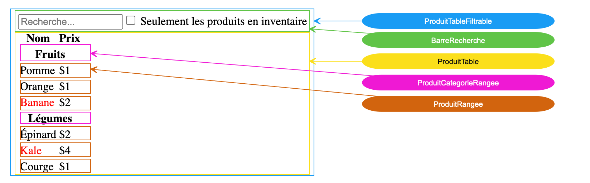

# Penser en React

## Introduction

Pour bien débuter une application en React, il est recommandé de débuter par une maquette froide de l'application. Cela permet de visualiser l'ensemble des composants nécessaires à la réalisation de l'application.

<figure markdown>
  { width="600" }
  <figcaption>Mockup d'une application simple</figcaption>
</figure>


## Étape 1 : Découper en composants

Pour découper l'application en composants, il est recommandé de suivre les étapes suivantes :

1. Identifier les composants réutilisables
2. Découper les composants en sous-composants
3. Définir la hiérarchie des composants

<figure markdown>
  { width="800" }
  <figcaption>Composants d'une application simple</figcaption>
</figure>

1. ProduitTableFiltrable (bleu) contient l'application au complet.
2. BarreRecherche (vert) reçoit l'entrée de l'utilisateur.
3. ProduitTable (jaune) affiche et filtre la liste selon l'entrée de l'utilisateur.
4. ProduitCategorieRangee (rose) affiche l'entête par catégorie.
5. ProduitRangee (brun) affiche une rangée pour un produit.

Ces composants peuvent être représentés en une hiérarchie de composants :

```plaintext
ProduitTableFiltrable
  BarreRecherche
  ProduitTable
    ProduitCategorieRangee
    ProduitRangee
```

## Étape 2 : Construire une version statique de l'application

!!! note "Passage de données par props"
    Les données sont passées de haut en bas dans React. Cela signifie que les données sont passées du composant parent au composant enfant par le biais de `props`.

Commencez pas le composant de produit le plus bas de la hiérarchie, `ProduitRangee`. Ce composant reçoit des données sous forme de `props` et les affiche.

``` ts title="ProduitRangee.tsx"
{!penser_react_static/src/components/ProduitRangee.tsx!}
```

Ensuite, construisez le composant `ProduitCategorieRangee` qui reçoit la catégorie sous forme de `props` et les affiche.

``` ts title="ProduitCategorieRangee.tsx"
{!penser_react_static/src/components/ProduitCategorieRangee.tsx!}
```

Enfin, construisez le composant `ProduitTable` qui reçoit les données sous forme de `props` et les affiche.

``` ts title="ProduitTable.tsx"
{!penser_react_static/src/components/ProduitTable.tsx!}
```

## Étape 3 : Identifier l'état minimal de l'application

Il faut maintenant identifier ce qui doit être conservé dans un état (state) VS ce qui est statique ou dérivé d'un état.

Quelles sont les données de notre application? 

1. La liste des produits originale
2. La catégorie des produits
3. Le texte de recherche
4. L'état de la case à cocher
5. Les produits filtrés

Quelles sont les données qui changent au cours du temps?

1. Le texte de recherche
2. L'état de la case à cocher
3. Les produits filtrés

Quelles sont les données qui peuvent être dérivées?

1. Les produits filtrés

Donc, quelles sont les états minimaux de notre application?

1. Le texte de recherche
2. L'état de la case à cocher

## Étape 4 : Identifier où l'état doit vivre

!!! note "Le principe de levée de l'état"
    L'état doit être levé au composant parent le plus proche qui a besoin d'y accéder.

Dans notre cas, le texte de recherche et l'état de la case à cocher seront utilisés par deux composants, `BarreRecherche` et `ProduitTable`. Donc, l'état doit être levé au composant parent commun, `ProduitTableFiltrable`.


``` ts title="ProduitTableFiltrable.tsx"
{!penser_react_final/src/components/ProduitTableFiltrable.tsx!}
```

## Étape 5 : Ajouter des interactions

Maintenant que l'état est levé au composant parent commun, nous pouvons ajouter des interactions à notre application.

!!! note "Passage de données par props"
    Les fonctions de rappel sont passées de haut en bas dans React. Cela signifie que les fonctions de rappel sont passées du composant parent au composant enfant par le biais de `props`.

Ajoutez une fonction de rappel pour gérer le changement de texte de recherche et de la case à cocher dans `BarreRecherche`.

``` ts title="BarreRecherche.tsx"
{!penser_react_final/src/components/BarreRecherche.tsx!}
```

``` ts title="ProduitTable.tsx"
{!penser_react_final/src/components/ProduitTable.tsx!}
```