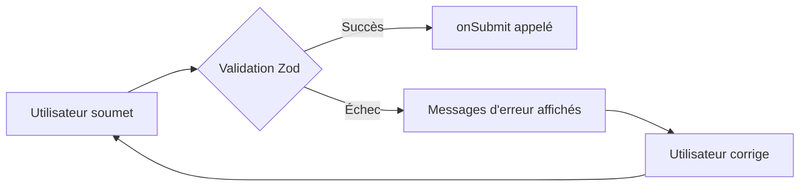

# Composantes UI : shadcn/ui

shadcn/ui est une collection de composantes réutilisables et accessibles construites avec [Radix UI](https://www.radix-ui.com/) et Tailwind CSS. Contrairement aux librairies de composantes traditionnelles, shadcn/ui **ne s'installe pas comme un package npm** — les composantes sont copiées directement dans votre projet, ce qui vous donne un contrôle total sur leur code source.

| Avantage | Description |
|---|---|
| **Code dans votre projet** | Les composantes font partie de votre code source, vous pouvez les modifier librement |
| **Accessibilité (ARIA)** | Construit sur Radix UI, chaque composante respecte les standards d'accessibilité |
| **Tailwind CSS natif** | Les styles utilisent vos classes Tailwind et s'adaptent à votre thème |
| **TypeScript** | Toutes les composantes sont typées |

!!! manuel
    [Documentation officielle shadcn/ui](https://ui.shadcn.com/)

# Prérequis

shadcn/ui nécessite **Tailwind CSS**. Assurez-vous d'avoir suivi la [leçon sur Tailwind CSS](react_tw.md) avant de continuer.

# Installation

## 1. Modifier tsconfig.json

shadcn/ui utilise l'alias `@/` pour importer ses composantes. Il faut configurer TypeScript pour reconnaître cet alias.

Modifiez `tsconfig.json` à la racine du projet :

``` json title="tsconfig.json"
{
  "files": [],
  "references": [
    { "path": "./tsconfig.app.json" }
  ],
  "compilerOptions": {
    "baseUrl": ".",
    "paths": {
      "@/*": ["./src/*"]
    }
  }
}
```

Modifiez aussi `tsconfig.app.json` pour ajouter les mêmes chemins dans les options du compilateur :

``` json title="tsconfig.app.json"
{
  "compilerOptions": {
    "baseUrl": ".",
    "paths": {
      "@/*": ["./src/*"]
    }
  }
}
```

## 2. Modifier vite.config.ts

Ajoutez la résolution de l'alias `@/` dans la configuration Vite :

``` ts title="vite.config.ts"
import path from "path"
import react from "@vitejs/plugin-react"
import tailwindcss from "@tailwindcss/vite"
import { defineConfig } from "vite"

export default defineConfig({
  plugins: [react(), tailwindcss()],
  resolve: {
    alias: {
      "@": path.resolve(__dirname, "./src"),
    },
  },
})
```

Installez ensuite le module Node pour la résolution de chemins :

``` nodejsrepl title="console"
npm install -D @types/node
```

## 3. Initialiser shadcn/ui

``` nodejsrepl title="console"
npx shadcn@latest init
```

L'assistant interactif vous posera quelques questions. Voici les choix recommandés :

``` nodejsrepl title="console"
✔ Which style would you like to use? › Default
✔ Which color would you like to use as the base color? › Neutral
✔ Would you like to use CSS variables for theming? › yes
```

Cette commande crée un fichier `components.json` de configuration et ajoute les styles de base dans votre fichier CSS.

## 4. Ajouter des composantes

Chaque composante s'installe séparément avec la commande `add`. Le code source de la composante est copié dans `src/components/ui/` :

``` nodejsrepl title="console"
npx shadcn@latest add button
npx shadcn@latest add navigation-menu
npx shadcn@latest add form
npx shadcn@latest add input
npx shadcn@latest add card
npx shadcn@latest add badge
```

!!! tip
    Vous pouvez ajouter plusieurs composantes d'un seul coup :
    ``` nodejsrepl title="console"
    npx shadcn@latest add button card badge input form navigation-menu
    ```

# Barre de navigation

La composante `NavigationMenu` permet de créer une barre de navigation avec des menus déroulants accessibles.

``` tsx title="src/components/NavBar/NavBar.tsx"
import {
  NavigationMenu,
  NavigationMenuContent,
  NavigationMenuItem,
  NavigationMenuLink,
  NavigationMenuList,
  NavigationMenuTrigger,
  navigationMenuTriggerStyle,
} from "@/components/ui/navigation-menu"
import { cn } from "@/lib/utils"

export function NavBar() {
  return (
    <header className="border-b px-6 py-3 flex items-center justify-between">
      <div className="font-bold text-xl">Ma Boutique</div>

      <NavigationMenu>
        <NavigationMenuList>

          {/* Lien simple */}
          <NavigationMenuItem>
            <NavigationMenuLink className={navigationMenuTriggerStyle()} href="/">
              Accueil
            </NavigationMenuLink>
          </NavigationMenuItem>

          {/* Menu déroulant */}
          <NavigationMenuItem>
            <NavigationMenuTrigger>Produits</NavigationMenuTrigger>
            <NavigationMenuContent>
              <ul className="grid gap-3 p-4 w-[300px]">
                <li>
                  <NavigationMenuLink asChild>
                    <a
                      href="/electronique"
                      className={cn("block p-3 rounded-md hover:bg-accent")}
                    >
                      <div className="font-medium">Électronique</div>
                      <p className="text-sm text-muted-foreground">
                        Téléphones, tablettes et plus
                      </p>
                    </a>
                  </NavigationMenuLink>
                </li>
                <li>
                  <NavigationMenuLink asChild>
                    <a
                      href="/vetements"
                      className={cn("block p-3 rounded-md hover:bg-accent")}
                    >
                      <div className="font-medium">Vêtements</div>
                      <p className="text-sm text-muted-foreground">
                        Mode homme et femme
                      </p>
                    </a>
                  </NavigationMenuLink>
                </li>
              </ul>
            </NavigationMenuContent>
          </NavigationMenuItem>

          {/* Lien simple */}
          <NavigationMenuItem>
            <NavigationMenuLink className={navigationMenuTriggerStyle()} href="/contact">
              Contact
            </NavigationMenuLink>
          </NavigationMenuItem>

        </NavigationMenuList>
      </NavigationMenu>
    </header>
  )
}
```

## Éléments clés de NavigationMenu

| Composante | Rôle |
|---|---|
| `NavigationMenu` | Conteneur principal |
| `NavigationMenuList` | Liste des éléments du menu |
| `NavigationMenuItem` | Un élément du menu |
| `NavigationMenuTrigger` | Bouton qui ouvre un sous-menu |
| `NavigationMenuContent` | Contenu du sous-menu déroulant |
| `NavigationMenuLink` | Lien de navigation |
| `navigationMenuTriggerStyle()` | Fonction qui retourne les classes de style d'un bouton de navigation |

!!! manuel
    [NavigationMenu — shadcn/ui](https://ui.shadcn.com/docs/components/navigation-menu)

# Formulaire

shadcn/ui intègre [react-hook-form](https://react-hook-form.com/) pour la gestion des formulaires et [Zod](https://zod.dev/) pour la validation des données.

## Installer les dépendances

``` nodejsrepl title="console"
npm install react-hook-form zod @hookform/resolvers
```

## Exemple de formulaire de contact

``` tsx title="src/components/FormulaireContact/FormulaireContact.tsx"
import { useForm } from "react-hook-form"
import { z } from "zod"
import { zodResolver } from "@hookform/resolvers/zod"
import { Button } from "@/components/ui/button"
import {
  Form,
  FormControl,
  FormDescription,
  FormField,
  FormItem,
  FormLabel,
  FormMessage,
} from "@/components/ui/form"
import { Input } from "@/components/ui/input"

// 1. Définir le schéma de validation avec Zod
const schemaFormulaire = z.object({
  nom: z.string().min(2, {
    message: "Le nom doit contenir au moins 2 caractères.",
  }),
  courriel: z.string().email({
    message: "Adresse courriel invalide.",
  }),
  message: z.string().min(10, {
    message: "Le message doit contenir au moins 10 caractères.",
  }),
})

// 2. Dériver le type TypeScript depuis le schéma
type DonneesFormulaire = z.infer<typeof schemaFormulaire>

export function FormulaireContact() {
  // 3. Initialiser react-hook-form avec le résolveur Zod
  const form = useForm<DonneesFormulaire>({
    resolver: zodResolver(schemaFormulaire),
    defaultValues: {
      nom: "",
      courriel: "",
      message: "",
    },
  })

  // 4. Gérer la soumission (appelée seulement si la validation passe)
  function onSubmit(donnees: DonneesFormulaire) {
    console.log("Formulaire soumis :", donnees)
  }

  return (
    <div className="max-w-md mx-auto p-6">
      <h2 className="text-2xl font-bold mb-6">Contactez-nous</h2>

      <Form {...form}>
        <form onSubmit={form.handleSubmit(onSubmit)} className="space-y-6">

          <FormField
            control={form.control}
            name="nom"
            render={({ field }) => (
              <FormItem>
                <FormLabel>Nom</FormLabel>
                <FormControl>
                  <Input placeholder="Jean Tremblay" {...field} />
                </FormControl>
                <FormMessage />
              </FormItem>
            )}
          />

          <FormField
            control={form.control}
            name="courriel"
            render={({ field }) => (
              <FormItem>
                <FormLabel>Courriel</FormLabel>
                <FormControl>
                  <Input placeholder="jean@example.com" type="email" {...field} />
                </FormControl>
                <FormDescription>
                  Nous ne partagerons jamais votre adresse.
                </FormDescription>
                <FormMessage />
              </FormItem>
            )}
          />

          <FormField
            control={form.control}
            name="message"
            render={({ field }) => (
              <FormItem>
                <FormLabel>Message</FormLabel>
                <FormControl>
                  <Input placeholder="Votre message..." {...field} />
                </FormControl>
                <FormMessage />
              </FormItem>
            )}
          />

          <Button type="submit" className="w-full">
            Envoyer
          </Button>

        </form>
      </Form>
    </div>
  )
}
```

## Flux de validation du formulaire



## Éléments clés du formulaire

| Composante | Rôle |
|---|---|
| `Form` | Fournit le contexte react-hook-form |
| `FormField` | Connecte un champ au formulaire via `control` et `name` |
| `FormItem` | Regroupe le label, le champ, la description et le message |
| `FormLabel` | Étiquette du champ |
| `FormControl` | Encapsule l'élément de saisie |
| `FormDescription` | Texte d'aide sous le champ |
| `FormMessage` | Affiche automatiquement le message d'erreur Zod |

!!! manuel
    [Form — shadcn/ui](https://ui.shadcn.com/docs/components/form)

!!! manuel
    [Zod — Documentation](https://zod.dev/)

# Grille de produits

La composante `Card` est idéale pour afficher des éléments dans une grille. Combinée avec `Badge` et `Button`, elle permet de créer des fiches produits complètes.

## Définir le type Produit

``` ts title="src/types/Produit.ts"
export type Produit = {
  id: number
  nom: string
  prix: number
  categorie: string
  description: string
  image: string
}
```

## Composante CarteProduit

``` tsx title="src/components/CarteProduit/CarteProduit.tsx"
import { Button } from "@/components/ui/button"
import {
  Card,
  CardContent,
  CardDescription,
  CardFooter,
  CardHeader,
  CardTitle,
} from "@/components/ui/card"
import { Badge } from "@/components/ui/badge"
import { Produit } from "@/types/Produit"

type Props = {
  produit: Produit
}

export function CarteProduit({ produit }: Props) {
  return (
    <Card className="flex flex-col">
      <CardHeader className="p-0">
        
        <div className="px-6 pt-4 flex items-start justify-between gap-2">
          <CardTitle className="text-lg">{produit.nom}</CardTitle>
          <Badge variant="secondary">{produit.categorie}</Badge>
        </div>
        <CardDescription className="px-6">
          {produit.description}
        </CardDescription>
      </CardHeader>

      <CardContent className="flex-1" />

      <CardFooter className="flex items-center justify-between">
        <span className="text-xl font-bold">{produit.prix.toFixed(2)} $</span>
        <Button>Ajouter au panier</Button>
      </CardFooter>
    </Card>
  )
}
```

## Composante GrilleProduits

``` tsx title="src/components/GrilleProduits/GrilleProduits.tsx"
import { CarteProduit } from "@/components/CarteProduit/CarteProduit"
import { Produit } from "@/types/Produit"

const produits: Produit[] = [
  {
    id: 1,
    nom: "Écouteurs sans fil",
    prix: 79.99,
    categorie: "Électronique",
    description: "Son haute fidélité avec réduction de bruit active.",
    image: "https://placehold.co/400x300",
  },
  {
    id: 2,
    nom: "Sac à dos urbain",
    prix: 49.95,
    categorie: "Accessoires",
    description: "Design moderne avec compartiment pour ordinateur 15 pouces.",
    image: "https://placehold.co/400x300",
  },
  {
    id: 3,
    nom: "Montre intelligente",
    prix: 199.0,
    categorie: "Électronique",
    description: "Suivi d'activité, notifications et autonomie de 7 jours.",
    image: "https://placehold.co/400x300",
  },
  {
    id: 4,
    nom: "Chaussures de course",
    prix: 124.99,
    categorie: "Sport",
    description: "Légères et confortables pour la course sur route.",
    image: "https://placehold.co/400x300",
  },
]

export function GrilleProduits() {
  return (
    <section className="p-6">
      <h2 className="text-3xl font-bold mb-6">Nos produits</h2>
      <div className="grid grid-cols-1 sm:grid-cols-2 lg:grid-cols-4 gap-6">
        {produits.map((produit) => (
          <CarteProduit key={produit.id} produit={produit} />
        ))}
      </div>
    </section>
  )
}
```

## Éléments clés de Card

| Composante | Rôle |
|---|---|
| `Card` | Conteneur principal avec bordure et ombre |
| `CardHeader` | Zone supérieure (titre, description) |
| `CardTitle` | Titre de la carte |
| `CardDescription` | Texte descriptif secondaire |
| `CardContent` | Corps de la carte |
| `CardFooter` | Zone inférieure (actions) |

!!! manuel
    [Card — shadcn/ui](https://ui.shadcn.com/docs/components/card)

# Intégration dans App.tsx

Voici comment assembler les trois composantes dans l'application principale :

``` tsx title="src/App.tsx"
import { NavBar } from "@/components/NavBar/NavBar"
import { GrilleProduits } from "@/components/GrilleProduits/GrilleProduits"

function App() {
  return (
    <div className="min-h-screen bg-background">
      <NavBar />
      <main>
        <GrilleProduits />
      </main>
    </div>
  )
}

export default App
```

!!! manuel
    [Tous les composantes shadcn/ui](https://ui.shadcn.com/docs/components/accordion)
