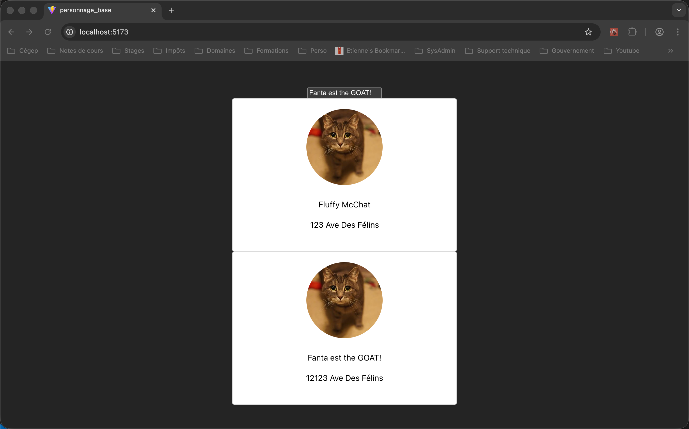

# Gestion de l'état d'un composant  

- Conserve l’état d’une variable
- Réagit lorsque la valeur change

```ts title="App.tsx"
--8<-- "personnage_base_useState/src/components/App/App.tsx"
```

<figure markdown>
  { width="600" }
  <figcaption>Affichage du projet personnage - base avec useState</figcaption>
</figure>


## Mécanique du useState  

Le composant réagit aux changements d'état des variables créées via useState. Pour que cette réaction se produise, il faut que React voit clairement qu'une valeur a changé.  

``` typescript 
import { useState } from "react";

function App() {

  const [nom, setNom] = useState("Fanta le Chat");
  const [tableau, setTableau] = useState(["Chat","Chien"]);

  nom = 'Roger'; // Assignation directe ne change pas l'état
  setNom('Rita'); // Utilisation appropriée de la fonction de changement de l'état

  tableau.push("Souris"); // Manipulation directe du tableau ne change pas l'état
  
  const nouveauTableau = tableau;
  nouveauTableau.push("Rat");
  setTableau(nouveauTableau); // Ne fonctionne pas, l'adresse du nouveauTableau est la même que tableau

  const bonTableau = [...tableau];
  bonTableau.push('Hamster');
  setTableau(bonTableau); // Le bonTableau a une adresse différente, utilisation appropriée de setTableau

  setTableau([...tableau, "Perruche"]); // Ça crée un nouveau tableau avec une adresse différente, utilisation appropriée

  return (
    <>
      <h1>{nom}</h1>
    </>
  );
}

``` 

Une méthode simple et efficace pour le changement d'un tableau d'objet et l'utilisation de `map`.

``` typescript  

import { useState } from 'react'

type absencesEleves = {
  id: number,
  nom: string,
  prenom: string,
  absences: number
};

const elevesParDefaut: absencesEleves[] = [
  { id: 1, nom: 'Wilco', prenom: 'Roger', absences: 3 },
  { id: 2, nom: 'Laffer', prenom: 'Larry', absences: 1 },
  { id: 3, nom: 'Bueller', prenom: 'Ferris', absences: 0 }
];


function App() {

  const [eleves, setEleves] = useState<absencesEleves[]>(elevesParDefaut);

  function incrementerAbsence(id: number) {
  setEleves((precedent) =>
    precedent.map((eleve) =>
      eleve.id === id
        ? { ...eleve, absences: eleve.absences + 1 }
        : eleve
    )
  );
}

  return (
    <>

      <h1>liste absences</h1>
      { eleves.map((eleve) => { return (
        <div key={eleve.id}>
          <span>{eleve.nom}</span>
          <span>{eleve.prenom}</span>
          <span>{eleve.absences}</span>
          <button onClick={() => incrementerAbsence(eleve.id)}>+1 absence</button>
        </div>)
      })}
      
    </>
  )
}
``` 


!!! manuel
    [React.dev useState](https://react.dev/reference/react/useState)

