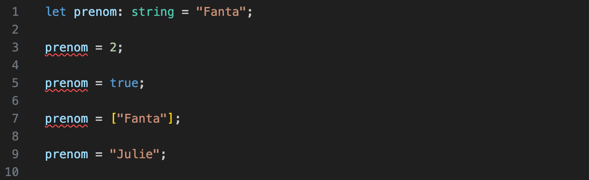
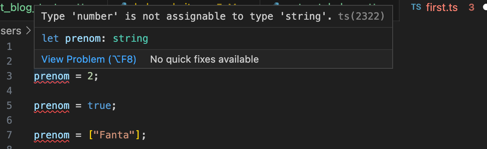
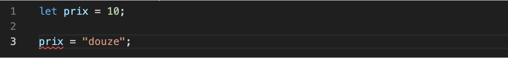
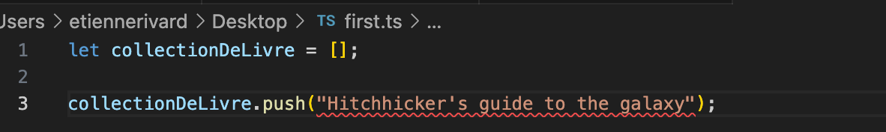
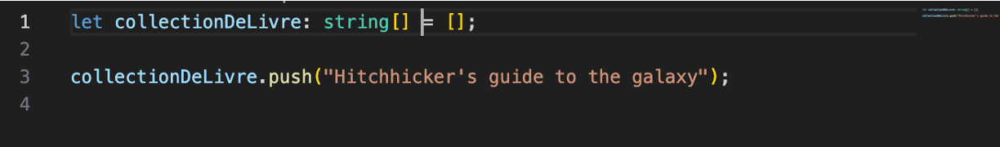
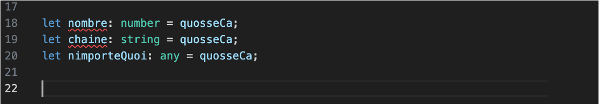

# Introduction à TypeScript

TypeScript c’est du JavaScript avec des types!

## Pourquoi utiliser TypeScript?  

TypeScript est un langage de programmation qui a gagné en popularité grâce à son utilité dans le développement logiciel moderne. Voici quelques raisons pour lesquelles vous pourriez envisager d'utiliser TypeScript dans vos programmes :  

1. **Sécurité et robustesse du code** : TypeScript introduit un système de types statiques qui permet de détecter des erreurs de typage dès la phase de développement. Cela aide à éviter de nombreux bugs liés aux types et garantit une meilleure qualité du code.  

2. **Meilleure maintenance** : Les systèmes de types aident les développeurs à comprendre plus facilement le code existant, à détecter des erreurs potentielles et à faciliter les refontes. Cela conduit à une meilleure maintenance à long terme.  

3. **Meilleure IDE (environnement de développement intégré) support** : Comme TypeScript fournit des informations détaillées sur les types, les IDE peuvent offrir une assistance au code plus puissante, comme l'autocomplétion, la vérification en temps réel et la navigation dans le code.  

4. **Évolution en douceur depuis JavaScript** : TypeScript est un sur-ensemble de JavaScript, ce qui signifie que vous pouvez migrer progressivement votre code JavaScript existant vers TypeScript sans avoir à tout réécrire. Les fichiers TypeScript peuvent contenir du code JavaScript valide.  

5. **Évite les erreurs courantes** : Les types statiques aident à éviter des erreurs courantes comme les références null ou undefined, les erreurs de type et d'autres problèmes fréquents en JavaScript.  

6. **Facilite la collaboration** : Les types statiques documentent de manière plus explicite les attentes concernant les données et les fonctions, ce qui facilite la collaboration entre les développeurs.  

7. **Meilleure échelle et modularité** : TypeScript encourage la construction d'applications modulaires avec des types spécifiques pour les interfaces et les contrats entre les modules. Cela rend les applications plus faciles à développer et à faire évoluer.  

8. **Communauté active et écosystème croissant** : TypeScript est soutenu par Microsoft et a une communauté active. De nombreux outils et bibliothèques populaires sont également compatibles avec TypeScript.  

9. **Compatibilité avec les normes ES** : TypeScript suit généralement les normes ES (ECMAScript), ce qui signifie qu'il prend en charge les fonctionnalités JavaScript modernes tout en ajoutant des fonctionnalités supplémentaires.  

10. **Meilleure documentation et apprentissage progressif** : TypeScript offre des informations plus détaillées sur le code, ce qui peut faciliter l'apprentissage d'un nouveau codebase ou l'intégration de nouveaux membres dans une équipe de développement.  

En résumé, utiliser TypeScript peut améliorer la qualité, la robustesse et la maintenabilité de votre code, tout en offrant des avantages en termes d'assistance au développement et de collaboration. Cependant, il est important de noter que le choix d'utiliser TypeScript dépend des besoins spécifiques de votre projet et de votre équipe.  

Aide à trouver les erreurs dans notre code.

!!! manuel  
    [Manuel TypeScript](https://www.typescriptlang.org/fr/docs/handbook/intro.html)  


# Installation de TypeScript  

Pour installer TypeScript, utiliser la commande suivante :

``` nodejsrepl title="console"
npm install –g typescript
```

!!! note

    Ça installe sur votre poste le compilateur TypeScript qui transforme le code en JavaScript. Nous allons voir npm plus en détail au prochain cours

# Indiquer les types aux variables  

<figure markdown>
  { width="600" }
  <figcaption>TypeScript indique que la variable est mal utilisée</figcaption>
</figure>


Dans votre éditeur de code, TypeScript dit que la variable prénom est un string et vous informe que vous l’utilisez avec un autre type. C’est la base de TypeScript, vous éviter des erreurs de la sorte.


<figure markdown>
  { width="600" }
  <figcaption>Erreur dans VSCode venant de TypeScript</figcaption>
</figure>

# Types primitifs  

TypeScript a les types primitifs suivants :  

- string  
- number  
- boolean  
- null  
- void  
- any  
- never  
- unknown  

## Inférence  

TypeScript peut deviner le type selon le contexte :  

<figure markdown>
  { width="600" }
  <figcaption>TypeScript devine le type par le contexte d'utilisation</figcaption>
</figure>

## L'inférence ne marche pas toujours  

Des fois, l’inférence ne fonctionne pas :  

<figure markdown>
  { width="600" }
  <figcaption>Inférence pas toujours parfait</figcaption>
</figure>

Dans ce cas, il faut être explicite :  

<figure markdown>
  { width="600" }
  <figcaption>Aider l'inférence</figcaption>
</figure>

## Any  

Le type Any est pour indiquer que vous prévoyez mettre plus d’un type dans la même variable.  

{==C’est à proscrire==}  

``` ts title="any.ts"
let quelqueChose : any = 'Une patate';

quelqueChose = 12;

quelqueChose = true;

quelqueChose = { nom: 'Taleb', prenom: 'Frédérick' };
```

Ça empêche TypeScript de vous aider!  


## Never  

Utilisé comme paramètre de retour d’une fonction qui ne se terminera jamais.  

``` ts title="boucle_sans_fin.ts"
function bloucleSansFin(): never {
  while (true) {
    console.log("À l'aide, je suis pris ici!");
  }
}
```


## Void  

Utiliser void lorsque votre fonction ne retourne pas de valeur :

``` ts title="bonjour.ts"
function direBonjour(): void {
  console.log("Bonjour!");
}
```

## Unknown  

Unknown est comme Any, dans le sens qu’il peut recevoir n’importe quel type.

``` ts title="unknown.ts"
let quosseCa: unknown;

quosseCa = 1;

quosseCa = "Deux";

quosseCa = false;
```

Mais unknown ne peut etre assigné à aucun autre type de variable que unknown et any:  

<figure markdown>
  { width="600" }
  <figcaption>TypeScript indique que la variable est mal utilisée</figcaption>
</figure>

## Objets  

Les objets peuvent être typés comme les variables :  

<figure markdown>
  { width="600" }
  <figcaption>Contrairement à JavaScript, TypeScript interdit d’ajouter des attributs à un objet après sa création.
</figcaption>
</figure>

## Types  

Si nous voulons créer plusieurs objets avec la même forme, créer un type peut aider :  

``` ts title="chat.ts"
{!intro_typescript/chat.ts!}
```  

On s’assure que tous les objets ont les mêmes attributs.  
On valide que seulement les objets d’un type peuvent être utilisés dans une fonction.  

## Paramètres de fonctions  

Très utile pour documenter une fonction :  

``` ts title="deux_nombres.ts"
/**
 * Multiplie deux nombres
 *
 * @param {number} nombre1 - Premier nombre
 * @param {number} nombre2 - Second nombre
 **/
function multiplierDeuxNombres(nombre1: number, nombre2: number): number {
  return nombre1 * nombre2;
}

const produit1 = multiplierDeuxNombres(2, 4);

const produit2 = multiplierDeuxNombres('DIX', 'DEUX'); // Donne une erreur
```

# Compiler TypeScript en JavaScript  


TypeScript ne peut pas être exécuté directement par Node ou par le navigateur. Il faut le compiler (parfois appelé « transpiler ») en JavaScript avant son exécution.  

``` nodejsrepl title="console"
tsc
```

## Configurer tsc  

Pour compiler, il est important de générer le fichier tsconfig.json avant de faire la commmande tsc :  


``` nodejsrepl title="console"
tsc -init
```

Voici les résultats, selon la version de JavaScript :  


## TypeScript
``` ts title="chat.ts"
{!intro_typescript/chat.ts!}
```

## JavaScript ES6
``` ts title="chat.js"
{!intro_typescript/chat_ES6.js!}
```

## JavaScript ES2022
``` ts title="chat.js"
{!intro_typescript/chat_ES2022.js!}
```

## Configuration de tsc – tsconfig.json

tsconfig.json permet de configurer comment tsc compile les fichiers TypeScript.  

Quelques paramètres utiles :  

``` json title="tsconfig.json"
{
  "compilerOptions": {
  "target": "ES2022" /* Set the JavaScript language version for emitted JavaScript and include compatible library declarations. */,
  "module": "commonjs" /* Specify what module code is generated. */,
  "outDir": "./dist",  /* Specify an output folder for all emitted files. */
  "strict": true /* Enable all strict type-checking options. */,
  "skipLibCheck": true /* Skip type checking all .d.ts files. */
  }
}
```  

!!! manuel    
    [What is a tsconfig.json](https://www.typescriptlang.org/docs/handbook/tsconfig-json.html)  
    [tsconfig reference](https://www.typescriptlang.org/tsconfig)  