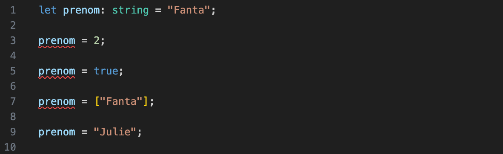
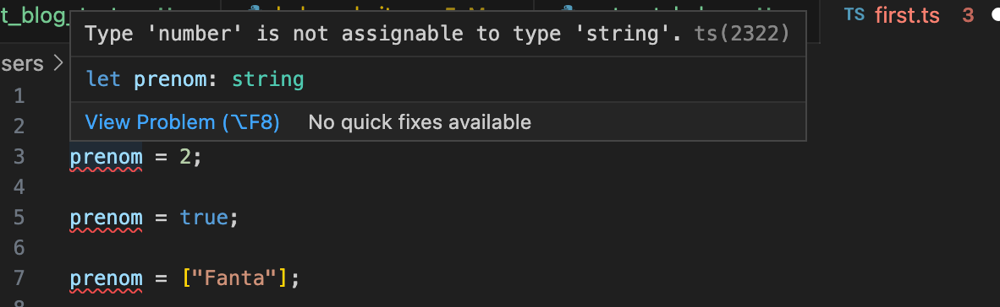
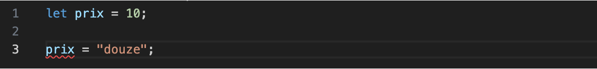
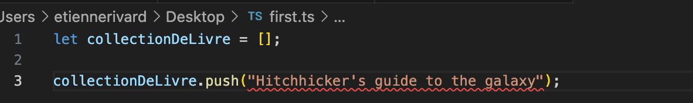
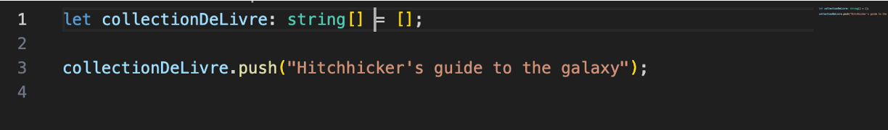
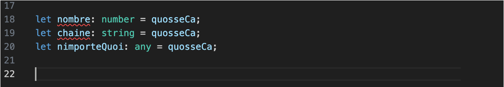
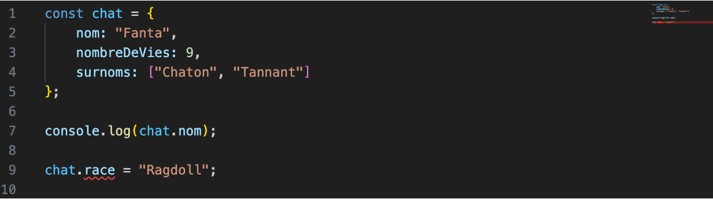
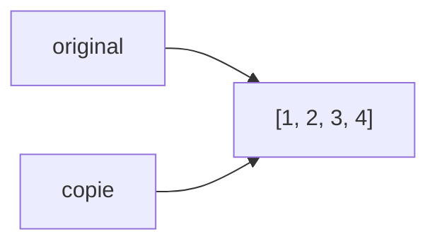
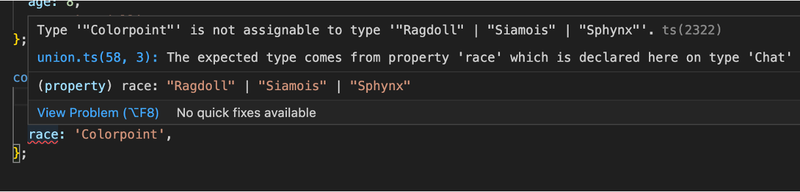

# Introduction à TypeScript

TypeScript c’est du JavaScript avec des types!

Pourquoi utiliser TypeScript? Ça aide à trouver les erreurs dans notre code.  

!!! manuel  
    [Manuel TypeScript](https://www.typescriptlang.org/fr/docs/handbook/intro.html)  


# Installation de TypeScript  

Pour installer TypeScript, utiliser la commande suivante :

``` nodejsrepl title="console"
npm install –g typescript
```

!!! note

    Ça installe sur votre poste le compilateur TypeScript qui transforme le code en JavaScript. Nous allons voir npm plus en détail au prochain cours

# Indiquer les types aux variables  

<figure markdown>
  { width="600" }
  <figcaption>TypeScript indique que la variable est mal utilisée</figcaption>
</figure>


Dans votre éditeur de code, TypeScript dit que la variable prénom est un string et vous informe que vous l’utilisez avec un autre type. C’est la base de TypeScript, vous éviter des erreurs de la sorte.


<figure markdown>
  { width="600" }
  <figcaption>Erreur dans VSCode venant de TypeScript</figcaption>
</figure>

# Types primitifs  

TypeScript a les types primitifs suivants :  

- string  
- number  
- boolean  
- null  
- void  
- any  
- never  
- unknown  

## Inférence  

TypeScript peut deviner le type selon le contexte :  

<figure markdown>
  { width="600" }
  <figcaption>TypeScript devine le type par le contexte d'utilisation</figcaption>
</figure>

## L'inférence ne marche pas toujours  

Des fois, l’inférence ne fonctionne pas :  

<figure markdown>
  { width="600" }
  <figcaption>Inférence pas toujours parfait</figcaption>
</figure>

Dans ce cas, il faut être explicite :  

<figure markdown>
  { width="600" }
  <figcaption>Aider l'inférence</figcaption>
</figure>

## Any  

Le type Any est pour indiquer que vous prévoyez mettre plus d’un type dans la même variable.  

{==C’est à proscrire==}  

``` ts title="any.ts"
let quelqueChose : any = 'Une patate';

quelqueChose = 12;

quelqueChose = true;

quelqueChose = { nom: 'Taleb', prenom: 'Frédérick' };
```

Ça empêche TypeScript de vous aider!  


## Never  

Utilisé comme paramètre de retour d’une fonction qui ne se terminera jamais.  

``` ts title="boucle_sans_fin.ts"
function bloucleSansFin(): never {
  while (true) {
    console.log("À l'aide, je suis pris ici!");
  }
}
```


## Void  

Utiliser void lorsque votre fonction ne retourne pas de valeur :

``` ts title="bonjour.ts"
function direBonjour(): void {
  console.log("Bonjour!");
}
```

## Unknown  

Unknown est comme Any, dans le sens qu’il peut recevoir n’importe quel type.

``` ts title="unknown.ts"
let quosseCa: unknown;

quosseCa = 1;

quosseCa = "Deux";

quosseCa = false;
```

Mais unknown ne peut etre assigné à aucun autre type de variable que unknown et any:  

<figure markdown>
  { width="600" }
  <figcaption>TypeScript indique que la variable est mal utilisée</figcaption>
</figure>

## Objets  

Les objets peuvent être typés comme les variables :  

<figure markdown>
  { width="600" }
  <figcaption>Contrairement à JavaScript, TypeScript interdit d’ajouter des attributs à un objet après sa création.
</figcaption>
</figure>

## Types  

Si nous voulons créer plusieurs objets avec la même forme, créer un type peut aider :  

``` ts title="chat.ts"
{!intro_typescript/chat.ts!}
```  

On s’assure que tous les objets ont les mêmes attributs.  
On valide que seulement les objets d’un type peuvent être utilisés dans une fonction.  

## Paramètres de fonctions  

Très utile pour documenter une fonction :  

``` ts title="deux_nombres.ts"
/**
 * Multiplie deux nombres
 *
 * @param {number} nombre1 - Premier nombre
 * @param {number} nombre2 - Second nombre
 **/
function multiplierDeuxNombres(nombre1: number, nombre2: number): number {
  return nombre1 * nombre2;
}

const produit1 = multiplierDeuxNombres(2, 4);

const produit2 = multiplierDeuxNombres('DIX', 'DEUX'); // Donne une erreur
```

# Compiler TypeScript en JavaScript  


TypeScript ne peut pas être exécuté directement par Node ou par le navigateur. Il faut le compiler (parfois appelé « transpiler ») en JavaScript avant son exécution.  

``` nodejsrepl title="console"
tsc
```

## Configurer tsc  

Pour compiler, il est important de générer le fichier tsconfig.json avant de faire la commmande tsc :  


``` nodejsrepl title="console"
tsc -init
```

Voici les résultats, selon la version de JavaScript :  


## TypeScript
``` ts title="chat.ts"
{!intro_typescript/chat.ts!}
```

## JavaScript ES6
``` ts title="chat.js"
{!intro_typescript/chat_ES6.js!}
```

## JavaScript ES2022
``` ts title="chat.js"
{!intro_typescript/chat_ES2022.js!}
```

## Configuration de tsc – tsconfig.json

tsconfig.json permet de configurer comment tsc compile les fichiers TypeScript.  

Quelques paramètres utiles :  

``` json title="tsconfig.json"
{
  "compilerOptions": {
  "target": "ES2022" /* Set the JavaScript language version for emitted JavaScript and include compatible library declarations. */,
  "module": "commonjs" /* Specify what module code is generated. */,
  "outDir": "./dist",  /* Specify an output folder for all emitted files. */
  "strict": true /* Enable all strict type-checking options. */,
  "skipLibCheck": true /* Skip type checking all .d.ts files. */
  }
}
```  

!!! manuel    
    [What is a tsconfig.json](https://www.typescriptlang.org/docs/handbook/tsconfig-json.html)  
    [tsconfig reference](https://www.typescriptlang.org/tsconfig)   


## Union de types  

L’union de type permet d’indiquer à TypeScript que nous acceptons deux types de données pour une variable ou un argument de fonction. Par exemple :  

``` ts title="union.ts"
function devineMonAge(age: number | string) {
    console.log(`Ton age est ${age}`);
}

devineMonAge(40);
devineMonAge('Trente huit');

```

!!! manuel  
    [Union dans TypeScript](https://www.typescriptlang.org/docs/handbook/typescript-in-5-minutes-func.html#unions)  


## Égalité : `==` vs `===`

JavaScript (et TypeScript) offre deux opérateurs de comparaison d’égalité :

| Opérateur | Nom | Comportement |
|-----------|-----|--------------|
| `==` | Égalité abstraite | Compare les valeurs **après conversion de type** |
| `===` | Égalité stricte | Compare les valeurs **et le type** sans conversion |

```ts title="egalite.ts"
console.log(1 == "1");   // true  ← JavaScript convertit "1" en number
console.log(1 === "1");  // false ← types différents (number vs string)

console.log(0 == false); // true  ← false est converti en 0
console.log(0 === false);// false ← types différents (number vs boolean)

console.log(null == undefined);  // true  ← cas spécial de ==
console.log(null === undefined); // false ← types différents
```

!!! warning "Toujours utiliser `===` en TypeScript"
    L’opérateur `==` peut produire des résultats surprenants à cause des conversions implicites. En TypeScript, utilisez toujours `===` (et `!==` pour l’inégalité). TypeScript avec la règle ESLint `eqeqeq` vous avertira si vous utilisez `==`.

!!! manuel
    [Égalité - MDN](https://developer.mozilla.org/fr/docs/Web/JavaScript/Equality_comparisons_and_sameness)

### Comparaison de tableaux et références en mémoire

Pour les tableaux (et les objets), `===` ne compare **pas les entrées** — il compare la **référence en mémoire**. Deux tableaux avec les mêmes valeurs ne sont pas égaux s'ils sont deux objets distincts en mémoire.

```ts title="tableaux_egalite.ts"
const a = [1, 2, 3];
const b = [1, 2, 3];

console.log(a === b); // false ← deux tableaux distincts en mémoire
console.log(a == b);  // false ← même résultat, même pour ==
```

De même, copier un tableau avec `=` ne crée **pas une copie** : les deux variables pointent vers le **même tableau en mémoire**. Modifier l'un modifie l'autre.

```ts title="tableaux_reference.ts"
const original = [1, 2, 3];
const copie = original; // ← copie la référence, pas les données!

copie.push(4);

console.log(original); // [1, 2, 3, 4] ← original est aussi modifié!
console.log(copie);    // [1, 2, 3, 4]
console.log(original === copie); // true ← même référence en mémoire
```


```mermaid
graph LR
    original --> T["[1, 2, 3, 4]"]
    copie --> T
```

Pour créer une vraie copie indépendante, il faut utiliser le **spread** `...` ou `Array.from()` :

```ts title="tableaux_copie.ts"
const original = [1, 2, 3];
const vraiecopie = [...original]; // ← nouveau tableau en mémoire

vraiecopie.push(4);

console.log(original);  // [1, 2, 3] ← inchangé
console.log(vraiecopie);// [1, 2, 3, 4]
console.log(original === vraiecopie); // false ← références différentes
```

!!! warning "Même comportement pour les objets"
    Les objets fonctionnent exactement de la même façon. `const b = a` copie la référence. Pour copier un objet, utilisez `{ ...a }` ou `structuredClone(a)` pour une copie profonde.

## Rétrécir le type

Quand nous acceptons plus d’un type pour un argument, il est parfois nécessaire de bien déterminer le type dans le corps de la fonction :  

Par exemple :  

``` ts title="retrecir.ts"
function doubler(item: number | string) {
    if (typeof item === 'string') {
        return `${item} - ${item}`;
    }   
    return item * 2;
}

console.log(doubler('Allo'));
console.log(doubler(12));
```  

!!! manuel  
    [Rétrécir le type - Manuel TypeScript](https://www.typescriptlang.org/docs/handbook/2/narrowing.html)  


## Union de type pour créer un alias  

``` ts title="alias.ts"
type Utilisateur = {
    nom: string;
    age: number;
    actif: boolean;
};

type Administrateur = {
    nom: string;
    niveau: number;
};

type Employe = Utilisateur | Administrateur;

```

!!! manuel  
    [Alias de types - Manuel TypeScript](https://www.typescriptlang.org/docs/handbook/declaration-files/by-example.html#reusable-types-type-aliases)  


## Rétrécir le type – autre exemple  

``` ts title="retrecir2.ts"
const roy: Administrateur = {
    nom: 'Roy',
    niveau: 99,
};

const richmond: Utilisateur = {
    nom: 'Richmond',
    age: 40,
    actif: true,
};

/**
 * Dire bonjour à un employé
 * 
 * @param {Employe} employe - L'employé à qui on dit bonjour 
 * 
 */
function direBonjour(employe: Employe) {
    if ('niveau' in employe) {
        console.log(
        `Bonjour Adminisatrateur ${employe.nom} de niveau ${employe.niveau}`
        );
        return;
    }
    console.log(`Bonjour Utilisateur ${employe.nom} agé de ${employe.age} ans`);
}

direBonjour(roy);
direBonjour(richmond);

```

## Union de type – pour restreindre les valeurs  

``` ts title="chat.ts"
type Chat {
    nom: string,
    age: number,
    race: 'Ragdoll' | 'Siamois' | 'Sphynx',
};

const fanta : Chat = {
    nom: 'Fanta',
    age: 8,
    race: 'Ragdoll',
};

/*
 * La race pour Furguie n'est pas acceptée pour le type Chat
 */
const furguie : Chat = {
    nom: 'Furguie',
    age: 3,
    race: 'colorpoint',
};

```

<figure markdown>
  { width="600" }
  <figcaption>Erreur lorsque la mauvaise valeur est assignée.</figcaption>
</figure>

## Enum  

Un enum nous permet de définir un ensemble de constantes nommées.  

``` ts title="race.ts"
enum Race {
    Ragdoll,
    Siamois,
    Sphynx,
}

type Chat = {
    nom: string;
    age: number;
    race: Race;
};

const fanta: Chat = {
    nom: 'Fanta',
    age: 8,
    race: Race.Ragdoll,
};

```

!!! manuel  
    [Enums - Manuel TypeScript](https://www.typescriptlang.org/docs/handbook/enums.html#handbook-content)  


## Interface  

Une interface est une façon différente en TypeScript pour décrire la forme d’un objet :  

``` ts title="race.ts"
enum Race {
    Ragdoll,
    Siamois,
    Sphynx,
}

interface Chat {
    nom: string;
    age: number;
    race: Race;
};

const fanta: Chat = {
    nom: 'Fanta',
    age: 8,
    race: Race.Ragdoll,
};

```

!!! manuel  
    [Interfaces - Manuel TypeScript](https://www.typescriptlang.org/docs/handbook/declaration-files/by-example.html#reusable-types-interfaces)  


## Generics  

Comme dans C#, TypeScript support les generics :  

``` ts title="generics.ts"
const listeDeChats : Array<Chat> = [];
```

!!! manuel  
    [Generics - Manuel TypeScript](https://www.typescriptlang.org/docs/handbook/2/generics.html#handbook-content)  

