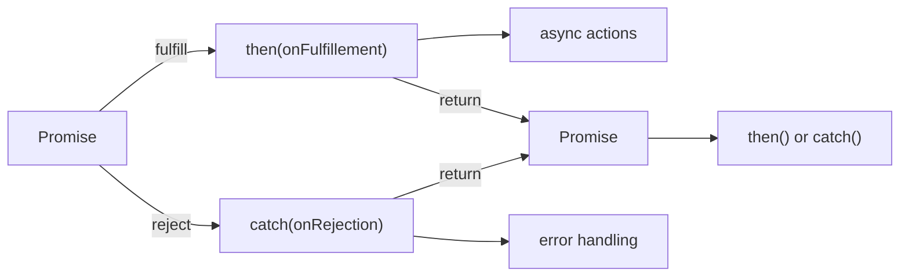

# JavaScript asynchrone  

Asynchrone : fait référence à un environnement de communication où chaque partie reçoit et traite les messages lorsque c'est possible ou plus pratique, au lieu de le faire au même moment.  

## JavaScript asynchrone
De nombreuses fonctionnalités des API Web utilisent désormais du code asynchrone pour s'exécuter, en particulier celles qui accèdent à un type de ressource ou le récupèrent à partir d'un périphérique externe, par exemple en récupérant un fichier sur le réseau, en accédant à une base de données et en renvoyant des données, en accédant à un flux vidéo à partir d'une webcam ou en diffusant l'affichage vers un casque VR.  

!!! manuel 
    [Concepts de l'asynchrone en JavaScript](https://developer.mozilla.org/fr/docs/Learn/JavaScript/Asynchronous/Concepts)  
    [Documentation MDN pour le JavaScript asynchrone](https://developer.mozilla.org/fr/docs/Learn/JavaScript/Asynchronous)   

## Fonctions de rappel asynchrones  

Les _callbacks_ asynchrones ou fonctions de rappels asynchrones sont des fonctions qui sont passées comme arguments lors de l'appel d'une fonction qui commencera à exécuter du code en arrière-plan. Lorsque le code d'arrière-plan a fini de s'exécuter, il appelle la fonction de rappel pour vous faire savoir que le travail est terminé, ou pour vous faire savoir que quelque chose d'intéressant s'est produit. L'utilisation des callbacks est un peu démodée aujourd'hui, mais vous les verrez encore dans un certain nombre d'API plus anciennes encore couramment utilisées.  

!!! manuel 
    [Introduction à l'asynchrone en JavaScript](https://developer.mozilla.org/fr/docs/Learn/JavaScript/Asynchronous/Introducing)  

## Promesses (Promises)  

Les promesses sont le nouveau style de code asynchrone que vous verrez utilisé dans les API Web modernes.  

L'objet Promise (pour « promesse ») est utilisé pour réaliser des traitements de façon asynchrone. Une promesse représente une valeur qui peut être disponible maintenant, dans le futur voire jamais.  

Une Promise est dans un de ces états :   

- pending (en attente) : état initial, la promesse n'est ni remplie, ni rompue ;  
- fulfilled (tenue) : l'opération a réussi ;  
- rejected (rompue) : l'opération a échoué ;  
- settled (acquittée) : la promesse est tenue ou rompue mais elle n'est plus en attente.  

Une promesse en attente peut être tenue avec une valeur ou rompue avec une raison (erreur). Quand on arrive à l'une des deux situations, les gestionnaires associés lors de l'appel de la méthode {==then==} sont alors appelés.




## Gérer les opérations asynchrones avec élégance grâce aux promesses  

Essentiellement, une promesse est un objet qui représente un état intermédiaire d'une opération - en fait, c'est une __promesse qu'un résultat d'une certaine nature sera retourné à un moment donné dans le futur__. Il n'y a {==aucune garantie du moment exact où l'opération se terminera et où le résultat sera renvoyé==}, mais il est une garantie que lorsque le résultat est disponible, ou que la promesse échoue, le code que vous fournissez sera exécuté afin de faire autre chose avec un résultat réussi, ou de gérer gracieusement un cas d'échec.  

L'une des utilisations les plus courantes des promesses concerne les API web qui renvoient une promesse.  

## Le problème des fonctions de rappel  

Code désordonné et difficile à lire :  

``` ts title="callback.ts"
choisirIngredients(function(ingredients) {
    placerLaCommande(ingredients, function(commande) {
        ramasserLaCommande(commande, function(pizza) {
            mangerLaPizza(pizza);
        }, gererErreur);
    }, gererErreur);
}, gererErreur);
```
 
Amélioration avec les promesses :  


``` ts title="promise.ts"
choisirIngredients()
    .then(function(ingredients) {
        placerLaCommande(ingredients);
    })
    .then(function(commande) {
        ramasserLaCommande(commande);
    })
    .then(function(pizza) {
        mangerLaPizza(pizza);
    })
    .catch(gererErreur);
```

## Fonctions fléchées  

Une expression de fonction fléchée permet d’avoir une syntaxe plus courte que les expressions de fonction. Les fonctions fléchées sont souvent anonymes et ne sont pas destinées à être utilisées pour déclarer des méthodes.  

``` ts title="promise_arrow.ts"
choisirIngredients()
    .then(ingredients => placerLaCommande(ingredients))
    .then(commande => ramasserLaCommande(commande))
    .then(pizza => mangerLaPizza(pizza))
    .catch(gererErreur);
```

!!! manuel 
    [Fonctions fléchées sur MDN](https://developer.mozilla.org/fr/docs/Web/JavaScript/Reference/Functions/Arrow_functions)  

## async et await  

Plus récemment, les fonctions async et le mot-clé await ont été ajoutés au langage JavaScript avec l'édition intitulée ECMAScript 2017. Ces fonctionnalités agissent essentiellement comme du sucre syntaxique sur les promesses, rendant le code asynchrone plus facile à écrire et à lire par la suite. Elles font en sorte que le code asynchrone ressemble davantage au code synchrone de la vieille école, et elles valent donc la peine d'être apprises.  


!!! manuel 
    [Async Await sur MDN](https://developer.mozilla.org/fr/docs/Learn/JavaScript/Asynchronous/Async_await)   


``` ts title="async.ts"
async function allo() { return "Bonjour" };
```

Pour consommer réellement la valeur renvoyée lorsque la promesse se réalise, puisqu'elle renvoie une promesse, nous pourrions utiliser un bloc .then() :  

``` ts title="async.ts"
allo().then((valeur) => console.log(valeur));
```

OU

``` ts title="async.ts"
allo().then(console.log);
```

L'avantage d'une fonction asynchrone ne devient apparent que lorsque vous la combinez avec le mot-clé await. await ne fonctionne qu'à l'intérieur de fonctions asynchrones dans du code JavaScript ordinaire, mais il peut être utilisé seul avec des modules JavaScript.  


!!! manuel 
    [Le mot clé await sur MDN](https://developer.mozilla.org/fr/docs/Learn/JavaScript/Asynchronous/Async_await#the_await_keyword)  

Await peut être placé devant toute fonction asynchrone basée sur une promesse pour mettre en pause votre code sur cette ligne jusqu'à ce que la promesse se réalise, puis retourner la valeur résultante. Vous pouvez utiliser await lors de l'appel de toute fonction qui renvoie une promesse, y compris les fonctions de l'API web.  


``` ts title="await.ts"
async function myFetch() {
    let response = await fetch('coffee.jpg');
    if (!response.ok) {
        throw new Error (`Erreur HTTP ! statut : ${response.status}`);
    }

    return await response.blob ();
}
```   
# Sous le capot de Node.JS 

## Exécution de code synchrone  

  

## Exécution de code avec promesse    

  


## Exécution de code avec setTimeout    

  

# Ordre traitement des appels asynchrones  

``` ts title="order.ts"
console.log('1 - Début du script');

setTimeout(() => {
  console.log('2 - setTimeout callback');
}, 0);

Promise.resolve()
  .then(() => {
    console.log('3 - Promise callback 1');
  })
  .then(() => {
    console.log('4 - Promise callback 2');
  });

console.log('5 - Fin du script');
```

## Solution    

  