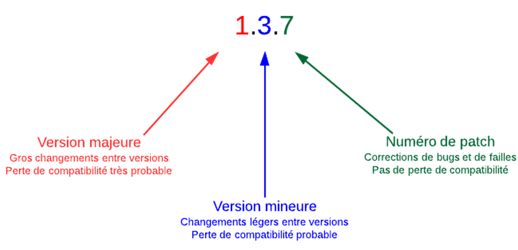

# NPM  

Npm est le gestionnaire de paquets (modules) officiel de Node.js. 
Celui-ci permet d’ajouter des modules externes dans une application Node.js
Depuis la version 0.6.3 de Node.js, npm fait partie de l'environnement et est donc automatiquement installé par défaut. 
npm fonctionne avec un terminal et gère les dépendances pour une application. Il permet également d'installer des applications Node.js disponibles sur le dépôt npm.

!!! manuel 
    [Documentation de npm js](https://docs.npmjs.com/)  
    [Wikipedia - Article sur npm](https://fr.wikipedia.org/wiki/Npm)  

# npm init  

La commande npm init permet d’initialiser un projet Node.js dans le but de gérer les modules associés au projet. 

``` nodejsrepl title="console"
npm init
```

Cette commande crée un fichier nommé package.json qui contiendra les configurations du projet ainsi que la liste des divers modules nécessaires pour son bon fonctionnement.  
{==Cette commande devrait toujours être exécutée avant de procéder à l’installation de modules.==}  

!!! manuel 
    [npm init](https://docs.npmjs.com/cli/v6/commands/npm-init)  


``` json title="packages.json"  
{
  "name": "AppName",
  "version": "0.1.0",
  "private": true,
  "dependencies": {
    "@types/node": "^16.18.32",
    "typescript": "^4.9.5",
    "web-vitals": "^2.1.4"
  }
}

```

# npm install  

La commande npm install permet d’installer des modules dans un projet.
Lors de l’ajout d’un premier module au projet, le dossier node_modules est automatiquement créé. 
Pour installer un module dans un projet :


``` nodejsrepl title="console"
npm install nomModule
```

Pour chaque installation de module :  
Un sous-dossier au nom du module est créé. Toutes les dépendances sont également chargées. Le module et ses dépendances sont ajoutées dans le fichier package.json 

Partage et Déploiement :  
Lorsqu’on partage un projet, on ne fournit généralement pas le dossier node_modules car sa taille peut devenir relativement élevée et les versions de Node.js ne sont pas nécessairement les mêmes. 
La commande npm install (sans préciser le nom du module) permet d’installer automatiquement tous les modules manquants (npm se fie au fichier package.json pour identifier les modules à installer)

## Les options  
Lors de l’installation de modules, je recommande toujours d’utiliser la commande disponible dans la procédure d’installation du module. 
Parfois, certaines options sont nécessaires.  

!!! manuel 
    [npm-install](https://docs.npmjs.com/cli/v6/commands/npm-install)  

Les plus courantes :  

- --save ou -S : Ajoute le module à la liste de dépendances dans le fichier package.json. Cette option n’est plus nécessaire depuis la version npm 5.0.0, les modules étant ajoutés par défaut à la liste de dépendances. Vous verrez cependant régulièrement cette option dans les procédures d’installation de modules officiels.  
- --global ou -g : Ajoute le module globalement sur votre PC. Je recommande peu cette option à moins que le module ne soit pas implicitement impliqué dans le projet. [npm global](https://docs.npmjs.com/ downloading-and-installing-packages-globally) (If you are using npm 5.2 or higher, we recommend using npx to run packages globally).  

## npm install --save-dev  

Dans votre développement, c’est possible que vous utilisiez des modules seulement pour aider le développement, mais qui ne sont pas nécessaires en production.

Dans ce cas, il faut utiliser npm install avec l’option --save-dev.  

Ex :   

``` nodejsrepl title="console"
npm install nodemon --save-dev
```

Dans packages.json ça donne :  

``` json title="packages.json"  
{
  "name": "AppName",
  "version": "0.1.0",
  "private": true,
  "dependencies": {
    "@types/node": "^16.18.32",
    "typescript": "^4.9.5",
    "web-vitals": "^2.1.4"
  },
  "devDependencies": {
    "nodemon": "^2.0.22"
  }
}
```

## Module d’aide au développement – nodemon  

Module qui observe les fichiers de votre projet et qui redémarre le programme automatiquement.

Pour faciliter l’utilisation de nodemon, ajouter un script dans packages.json : 

``` json title="packages.json"  
{
  "name": "AppName",
  "version": "0.1.0",
  "private": true,
  "dependencies": {
    "@types/node": "^16.18.32",
    "typescript": "^4.9.5",
    "web-vitals": "^2.1.4"
  },
   "scripts": {
    "start": "nodemon fichier.js"
  },
  "devDependencies": {
    "nodemon": "^2.0.22"
  }
}
```


Pour exécuter votre programme, il suffit de faire la commande :

``` nodejsrepl title="console"
npm start
```

## nodemon vs node --watch

Les versions modernes de node.js (>18) ont les fonctionnalités de base de `nodemon`. Il suffit de faire la commande suivante :

```
node --watch programme.js
```

Le seul avantage de `nodemon` est la possibilité de redémarrer le programme avec la commande `rs`.

## Module d’aide au développement – concurrently  

Module qui permet d’exécuter plusieurs commandes en même temps. Utile pour rouler tsc et nodemon en même temps.  

Pour installer concurrently : 

``` nodejsrepl title="console"
npm install concurrently --save-dev  
```

Pour que tsc compile automatiquement votre code, utiliser la commande :  

``` nodejsrepl title="console"
tsc –watch   
```


Donc, pour compiler et exécuter en même temps, écrire le script suivant dans package.json :

``` json title="packages.json"  
{
  "name": "AppName",
  "version": "0.1.0",
  "private": true,
  "dependencies": {
    "@types/node": "^16.18.32",
    "typescript": "^4.9.5",
    "web-vitals": "^2.1.4"
  },
   "scripts": {
    "start": "nodemon fichier.js",
    "dev": "concurrently \"tsc --watch\" \"nodemon -q ./dist/serveur.js\""
  },
  "devDependencies": {
    "nodemon": "^2.0.22"
  }
}
```

## Module dotenv  

À partir de node 20.6.0, il est possible de créer un fichier .env pour y mettre les paramètres de votre application.

Paramétrer votre application directement dans le code est imprudent. Des informations confidentielles peuvent se retrouver dans votre repo GitHub à la vue de tout le monde, ex :  


``` ts title="a_ne_pas_faire.ts"
const cleAPI = "FKSDKLJFKDSKLJF898FSDKJKSD898F9DSKLFDSKFSD";
const utilisateurBD = "admin";
const motDePasse="password";
```

Fichier contenant les paramètres : .env  

``` ini title=".env"  
cleAPI="FKSDKLJFKDSKLJF898FSDKJKSD898F9DSKLFDSKFSD"
utilisateurBD="admin"
motDePasse="password"
```

Utilisation dans le code :  

``` js title="a_faire.ts"
const cleAPI = process.env.cleAPI;
console.log(cleAPI);
```

``` nodejsrepl title="console"
node --env-file=.env a_faire.js
```

## npm – mise à jour  

Commande pour mettre à jour les modules de votre application :  

``` nodejsrepl title="console"
npm update [-g] [<pkg>...]
```

<figure markdown>
  { width="600" }
  <figcaption>Versions de modules NPM</figcaption>
</figure>


``` json title="packages.json"  
"dependencies": {
    "markdown": "0.3.5" // Version 0.3.5 uniquement
}
"dependencies": {
    "markdown": "~0.3.5" // OK pour les versions 0.3.5, 0.3.6, 0.3.7, etc. jusqu'à la version 0.4.0 non incluse
}
"dependencies": {
    "markdown": "~0.3" // OK pour les versions 0.3.X, 0.4.X, 0.5.X jusqu'à la version 1.0.0 non incluse
}
```

## ES6 et CommonJS  

Node.js est bâtie sur le moteur __V8__. La version ECMAScript 2016 n’est pas encore totalement supportée: [Node.js vs ES6](https://nodejs.org/en/docs/es6/)  
Pour plus d’information : [Node Green](https://node.green/)  
Pour ces raisons, TypeScript doit compiler en ES6 pour assurer la plus grande compatibilité avec Node.  

## npm - Publier  

Toute personne ayant un compte npm peut publier un module
La procédure est détaillée dans la documentation officielle npm : [Publishing](https://docs.npmjs.com/creating-and-publishing-scoped-public-packages)  

## npm - Sécurité  

Il importe de faire attention lors de l’ajout d’un module. Il faut s’assurer que le module est sécuritaire.  

- [Article Medium](https://medium.com/intrinsic-blog/common-node-js-attack-vectors-the-dangers-of-malicious-modules-863ae949e7e8)  
- [Article ZDNet](https://www.zdnet.fr/actualites/un-module-npm-malveillant-vole-des-donnees-sur-les-systemes-unix-39897337.htm)  
- [Article ICHI](https://ichi.pro/fr/meilleures-pratiques-de-securite-nodejs-361400695056)  
- [Info sur le GitHub de Node.js](https://github.com/nodejs/node/blob/HEAD/SECURITY.md#security)  
- [Article Developpez.com](https://securite.developpez.com/actu/309772/Quatre-packages-npm-trouves-en-train-d-ouvrir-des-shells-sur-des-systemes-Linux-et-Windows-Tout-ordinateur-avec-l-un-de-ces-packages-installes-doit-etre-considere-comme-totalement-compromis/)  

## .gitignore vs node et .env  

Il est essentiel de ne pas envoyer dans votre dépôt git le dossier node_modules, ajoutez cette ligne dans .gitignore :  

``` ini title=".gitignore"  
**/node_modules
```

De plus, il ne faut pas envoyer votre fichier de configuration :  

``` ini title=".gitignore"  
.env  
```

Enfin, ne pas envoyer les fichiers JavaScripts compilés de TypeScript :  

``` ini title=".gitignore"  
dist/  
```

## Module Lodash (_)  

Le module Lodash (pour low dash ou en français : souligné) implémente des fonctions communes fréquemment utilisées par les programmeurs :  

- Itérer à travers des tableaux, des objets et des chaînes de caractères  
- Manipuler et tester des valeurs  

Pour l’installer :  

``` nodejsrepl title="console"
npm install lodash
```

Pour la compatibilité Typescript :

``` nodejsrepl title="console"
npm install @types/lodash  
```

Pour l’utiliser :  

``` ts title="code.ts"
import _ from 'lodash';  
```

!!! manuel 
    [Documentation officielle de lodash](https://lodash.com)  


