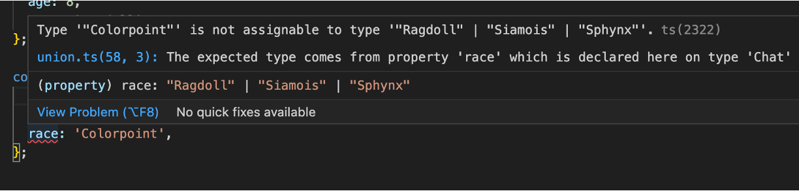

# TypeScript 2  

## Union de types  

L’union de type permet d’indiquer à TypeScript que nous acceptons deux types de données pour une variable ou un argument de fonction. Par exemple :  

``` ts title="union.ts"
function devineMonAge(age: number | string) {
    console.log(`Ton age est ${age}`);
}

devineMonAge(40);
devineMonAge('Trente huit');

```

!!! manuel  
    [Union dans TypeScript](https://www.typescriptlang.org/docs/handbook/typescript-in-5-minutes-func.html#unions)  


## Rétrécir le type  

Quand nous acceptons plus d’un type pour un argument, il est parfois nécessaire de bien déterminer le type dans le corps de la fonction :  

Par exemple :  

``` ts title="retrecir.ts"
function doubler(item: number | string) {
    if (typeof item === 'string') {
        return `${item} - ${item}`;
    }   
    return item * 2;
}

console.log(doubler('Allo'));
console.log(doubler(12));
```  

!!! manuel  
    [Rétrécir le type - Manuel TypeScript](https://www.typescriptlang.org/docs/handbook/2/narrowing.html)  


## Union de type pour créer un alias  

``` ts title="alias.ts"
type Utilisateur = {
    nom: string;
    age: number;
    actif: boolean;
};

type Administrateur = {
    nom: string;
    niveau: number;
};

type Employe = Utilisateur | Administrateur;

```

!!! manuel  
    [Alias de types - Manuel TypeScript](https://www.typescriptlang.org/docs/handbook/declaration-files/by-example.html#reusable-types-type-aliases)  


## Rétrécir le type – autre exemple  

``` ts title="retrecir2.ts"
const roy: Administrateur = {
    nom: 'Roy',
    niveau: 99,
};

const richmond: Utilisateur = {
    nom: 'Richmond',
    age: 40,
    actif: true,
};

/**
 * Dire bonjour à un employé
 * 
 * @param {Employe} employe - L'employé à qui on dit bonjour 
 * 
 */
function direBonjour(employe: Employe) {
    if ('niveau' in employe) {
        console.log(
        `Bonjour Adminisatrateur ${employe.nom} de niveau ${employe.niveau}`
        );
        return;
    }
    console.log(`Bonjour Utilisateur ${employe.nom} agé de ${employe.age} ans`);
}

direBonjour(roy);
direBonjour(richmond);

```

## Union de type – pour restreindre les valeurs  

``` ts title="chat.ts"
type Chat {
    nom: string,
    age: number,
    race: 'Ragdoll' | 'Siamois' | 'Sphynx',
};

const fanta : Chat = {
    nom: 'Fanta',
    age: 8,
    race: 'Ragdoll',
};

/*
 * La race pour Furguie n'est pas acceptée pour le type Chat
 */
const furguie : Chat = {
    nom: 'Furguie',
    age: 3,
    race: 'colorpoint',
};

```

<figure markdown>
  { width="600" }
  <figcaption>Erreur lorsque la mauvaise valeur est assignée.</figcaption>
</figure>

## Enum  

Un enum nous permet de définir un ensemble de constantes nommées.  

``` ts title="race.ts"
enum Race {
    Ragdoll,
    Siamois,
    Sphynx,
}

type Chat = {
    nom: string;
    age: number;
    race: Race;
};

const fanta: Chat = {
    nom: 'Fanta',
    age: 8,
    race: Race.Ragdoll,
};

```

!!! manuel  
    [Enums - Manuel TypeScript](https://www.typescriptlang.org/docs/handbook/enums.html#handbook-content)  


## Interface  

Une interface est une façon différente en TypeScript pour décrire la forme d’un objet :  

``` ts title="race.ts"
enum Race {
    Ragdoll,
    Siamois,
    Sphynx,
}

interface Chat {
    nom: string;
    age: number;
    race: Race;
};

const fanta: Chat = {
    nom: 'Fanta',
    age: 8,
    race: Race.Ragdoll,
};

```

!!! manuel  
    [Interfaces - Manuel TypeScript](https://www.typescriptlang.org/docs/handbook/declaration-files/by-example.html#reusable-types-interfaces)  


## Generics  

Comme dans C#, TypeScript support les generics :  

``` ts title="generics.ts"
const listeDeChats : Array<Chat> = [];
```

!!! manuel  
    [Generics - Manuel TypeScript](https://www.typescriptlang.org/docs/handbook/2/generics.html#handbook-content)  


